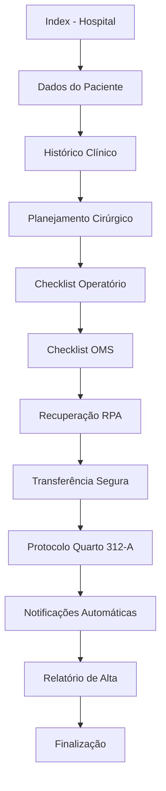

# 🏥 Sistema de Prontuário Eletrônico do Paciente (PEP)

Sistema web responsivo para gerenciamento de prontuário médico eletrônico, desenvolvido com foco em segurança, usabilidade e conformidade com protocolos hospitalares.

## 📋 Índice

- [Visão Geral](#visão-geral)
- [Características](#características)
- [Arquitetura do Sistema](#arquitetura-do-sistema)
- [Estrutura do Projeto](#estrutura-do-projeto)
- [Tecnologias Utilizadas](#tecnologias-utilizadas)
- [Instalação e Configuração](#instalação-e-configuração)
- [Fluxo de Navegação](#fluxo-de-navegação)
- [Guia de Uso](#guia-de-uso)
- [Responsividade](#responsividade)
- [Segurança e Validação](#segurança-e-validação)
- [Contribuindo](#contribuindo)
- [Licença](#licença)

---

## 🎯 Visão Geral

O **Sistema de Prontuário Eletrônico do Paciente (PEP)** é uma aplicação web moderna que digitaliza o processo de registro médico hospitalar, desde a admissão até a alta do paciente. O sistema garante que todas as etapas obrigatórias sejam cumpridas sequencialmente, proporcionando segurança e rastreabilidade.

### Hospital NeoVida
Sistema desenvolvido especialmente para ambientes hospitalares que buscam:
- ✅ Conformidade com protocolos de segurança da OMS
- ✅ Registro completo e estruturado do histórico do paciente
- ✅ Fluxo controlado e sequencial de etapas
- ✅ Interface intuitiva e responsiva

---

## ✨ Características

### Funcionalidades Principais

1. **Fluxo Sequencial Obrigatório**
   - Navegação controlada entre etapas
   - Validação de preenchimento de campos obrigatórios
   - Persistência automática de dados

2. **12 Etapas do Prontuário**
   - ✅ Dados do Hospital
   - ✅ Dados do Paciente
   - ✅ Histórico Clínico
   - ✅ Planejamento Cirúrgico
   - ✅ Checklist Operatório
   - ✅ Checklist de Cirurgia Segura (OMS)
   - ✅ Recuperação Pós-Anestésica (RPA)
   - ✅ Transferência Segura para o Quarto
   - ✅ Protocolo de Segurança no Quarto 312-A
   - ✅ Sistema de Notificações Automáticas
   - ✅ Relatório de Alta Hospitalar
   - ✅ Finalização e Exportação

3. **Recursos de Finalização**
   - 🖨️ Impressão do prontuário completo
   - 📄 Exportação para PDF
   - 📤 Compartilhamento de relatórios
   - ✅ Geração de alta hospitalar

4. **Design Responsivo**
   - 📱 Mobile First
   - 💻 Tablets
   - 🖥️ Desktop
   - 🖨️ Layout otimizado para impressão

---

## 🏗️ Arquitetura do Sistema

### Arquitetura de Camadas

```
┌─────────────────────────────────────────┐
│         CAMADA DE APRESENTAÇÃO          │
│  (HTML5 + CSS3 + JavaScript Vanilla)    │
└─────────────────────────────────────────┘
                    ↓
┌─────────────────────────────────────────┐
│         CAMADA DE CONTROLE              │
│   • flow.js (Navegação e Sequência)     │
│   • validation.js (Validação)           │
│   • ui.js (Interações UI)               │
└─────────────────────────────────────────┘
                    ↓
┌─────────────────────────────────────────┐
│         CAMADA DE DADOS                 │
│   • storage.js (LocalStorage API)       │
│   • Persistência no navegador           │
└─────────────────────────────────────────┘
                    ↓
┌─────────────────────────────────────────┐
│         CAMADA DE EXPORTAÇÃO            │
│   • pdf-export.js (Geração PDF)         │
│   • print-share.js (Impressão/Share)    │
└─────────────────────────────────────────┘
```

### Padrões de Projeto Utilizados

1. **Module Pattern** - Encapsulamento de lógica nos scripts JS
2. **Observer Pattern** - Event listeners para interação do usuário
3. **State Pattern** - Gerenciamento de estado via localStorage
4. **Chain of Responsibility** - Validação sequencial de formulários

---

## 📁 Estrutura do Projeto

```
medical-record-web-app/
│
├── src/
│   ├── pages/                          # Páginas HTML
│   │   ├── index.html                  # Página inicial - Dados do Hospital
│   │   ├── patient-data.html           # Dados do Paciente
│   │   ├── clinical-history.html       # Histórico Clínico
│   │   ├── surgical-planning.html      # Planejamento Cirúrgico
│   │   ├── surgical-checklist.html     # Checklist Operatório
│   │   ├── who-safe-surgery-checklist.html  # Checklist OMS
│   │   ├── rpa-recovery.html           # Recuperação Pós-Anestésica
│   │   ├── safe-transfer-room.html     # Transferência Segura
│   │   ├── room-312a-safety-protocol.html   # Protocolo Quarto 312-A
│   │   ├── automatic-notification.html # Sistema de Notificações
│   │   ├── discharge-report.html       # Relatório de Alta
│   │   └── finalize.html               # Página de Finalização
│   │
│   ├── css/                            # Folhas de Estilo
│   │   ├── style.css                   # Estilos principais + responsividade
│   │   └── theme.css                   # Tema de cores e componentes
│   │
│   ├── js/                             # Scripts JavaScript
│   │   ├── flow.js                     # Controle de fluxo e navegação
│   │   ├── storage.js                  # API de armazenamento LocalStorage
│   │   ├── validation.js               # Validação de formulários
│   │   ├── pdf-export.js               # Exportação para PDF
│   │   ├── print-share.js              # Impressão e compartilhamento
│   │   └── ui.js                       # Melhorias de interface
│   │
│   └── assets/                         # Recursos estáticos
│       ├── fonts/                      # Fontes customizadas
│       └── images/                     # Imagens e ícones
│
├── README.md                           # Documentação do projeto
└── LICENSE                             # Licença MIT

```

---

## 🛠️ Tecnologias Utilizadas

### Front-end
- **HTML5** - Estrutura semântica e acessível
- **CSS3** - Estilização moderna com Flexbox e Grid
- **JavaScript (ES6+)** - Lógica de aplicação vanilla

### Armazenamento
- **LocalStorage API** - Persistência de dados no navegador

### Bibliotecas Externas (Futuras)
- **jsPDF** - Geração de PDF (a ser implementado)
- **html2canvas** - Captura de tela para PDF (a ser implementado)

### Padrões e Protocolos
- **WHO Safe Surgery Checklist** - Protocolo de cirurgia segura
- **Responsive Web Design** - Mobile First Approach
- **Acessibilidade (WCAG 2.1)** - Boas práticas de acessibilidade

---

## 🚀 Instalação e Configuração

### Pré-requisitos
- Navegador web moderno (Chrome, Firefox, Edge, Safari)
- Servidor web local (opcional para desenvolvimento)

### Instalação

1. **Clone o repositório**
```bash
git clone https://github.com/seu-usuario/medical-record-web-app.git
cd medical-record-web-app
```

2. **Estrutura de pastas**
```bash
# Verifique se a estrutura está correta
tree src/
```

3. **Inicie um servidor local** (opcional)

Usando Python:
```bash
cd medical-record-web-app
python -m http.server 8000
```

Usando Node.js (http-server):
```bash
npm install -g http-server
http-server -p 8000
```

Usando VS Code Live Server:
- Instale a extensão "Live Server"
- Clique com botão direito em `index.html`
- Selecione "Open with Live Server"

4. **Acesse a aplicação**
```
http://localhost:8000/src/pages/index.html
```

---

## 🔄 Fluxo de Navegação

### Sequência Obrigatória



### Regras de Navegação

1. ✅ **Sequência Linear**: O usuário só pode avançar para a próxima etapa
2. ✅ **Validação Obrigatória**: Campos obrigatórios devem ser preenchidos
3. ✅ **Persistência Automática**: Dados salvos ao clicar em "Salvar e continuar"
4. ✅ **Barreira de Acesso**: Não é possível pular etapas via URL direta
5. ✅ **Reinício de Prontuário**: Botão "Iniciar novo prontuário" limpa todos os dados

---

## 📖 Guia de Uso

### Iniciando um Novo Prontuário

1. Acesse a página inicial (`index.html`)
2. Clique em **"Iniciar novo prontuário"** (limpa dados anteriores)
3. Preencha o nome do hospital
4. Clique em **"Salvar e continuar"**

### Preenchendo as Etapas

Para cada página:
1. Preencha todos os campos obrigatórios (marcados com `*`)
2. Revise as informações inseridas
3. Clique em **"Salvar e continuar"**
4. O sistema avança automaticamente para a próxima etapa

### Finalizando o Prontuário

Na página de finalização, você pode:
- 🖨️ **Imprimir**: Imprime o prontuário completo
- 📄 **Exportar PDF**: Gera um arquivo PDF para download
- 📤 **Compartilhar**: Compartilha via email ou outras plataformas
- ✅ **Gerar Alta Hospitalar**: Marca o paciente como liberado

---

## 📱 Responsividade

### Breakpoints Definidos

```css
/* Mobile (padrão) */
< 768px

/* Tablet */
768px - 1023px

/* Desktop */
1024px - 1439px

/* Large Desktop */
≥ 1440px
```

### Adaptações por Dispositivo

#### 📱 Mobile (< 768px)
- Layout em coluna única
- Formulários em orientação vertical
- Botões em largura total
- Tamanho de fonte reduzido (16px base)

#### 💻 Tablet (768px - 1023px)
- Formulários com labels ao lado dos campos
- Grid de 2 colunas para cards
- Navegação horizontal
- Tamanho de fonte intermediário

#### 🖥️ Desktop (≥ 1024px)
- Layout em grid de 3 colunas
- Formulários com labels fixos (250px)
- Todos os recursos visíveis
- Tamanho de fonte ampliado (18px em 1440px+)

### Testando Responsividade

1. Abra o DevTools (F12)
2. Clique no ícone de dispositivo móvel (Ctrl+Shift+M)
3. Selecione diferentes tamanhos de tela
4. Teste a navegação em cada breakpoint

---

## 🔒 Segurança e Validação

### Validação de Formulários

1. **HTML5 Validation**: Atributos `required`, `type`, `pattern`
2. **JavaScript Validation**: Função `reportValidity()` antes de salvar
3. **Sanitização**: Armazenamento seguro em JSON via `localStorage`

### Controle de Acesso

```javascript
// Função enforceSequence() em flow.js
// Redireciona automaticamente se etapas anteriores não foram concluídas
function enforceSequence() {
  const cur = currentPage();
  const idx = pageIndex(cur);
  if (idx <= 0) return;
  
  const missing = firstIncompleteBefore(idx);
  if (missing) {
    window.location.replace(missing);
  }
}
```

### Armazenamento de Dados

- **LocalStorage**: Dados persistem apenas no navegador do usuário
- **Chaves únicas**: `form:nomeDaPagina.html` para cada etapa
- **Marcadores de conclusão**: `done:nomeDaPagina.html` para controle de fluxo

⚠️ **Atenção**: LocalStorage não é criptografado. Para ambientes de produção, implemente:
- Backend com banco de dados seguro
- Autenticação e autorização
- Criptografia de dados sensíveis
- Conformidade com LGPD/HIPAA

---

## 🤝 Contribuindo

Contribuições são bem-vindas! Para contribuir:

1. **Fork** o projeto
2. Crie uma **branch** para sua feature (`git checkout -b feature/NovaFuncionalidade`)
3. **Commit** suas mudanças (`git commit -m 'Adiciona nova funcionalidade'`)
4. **Push** para a branch (`git push origin feature/NovaFuncionalidade`)
5. Abra um **Pull Request**

### Diretrizes de Contribuição

- Mantenha o código limpo e bem documentado
- Siga os padrões de código existentes
- Teste em múltiplos navegadores
- Atualize a documentação quando necessário
- Respeite a responsividade em todas as telas

---

## 📄 Licença

Este projeto está licenciado sob a **MIT License**.

```
MIT License

Copyright (c) 2025 Hospital NeoVida

Permission is hereby granted, free of charge, to any person obtaining a copy
of this software and associated documentation files (the "Software"), to deal
in the Software without restriction, including without limitation the rights
to use, copy, modify, merge, publish, distribute, sublicense, and/or sell
copies of the Software, and to permit persons to whom the Software is
furnished to do so, subject to the following conditions:

The above copyright notice and this permission notice shall be included in all
copies or substantial portions of the Software.

THE SOFTWARE IS PROVIDED "AS IS", WITHOUT WARRANTY OF ANY KIND, EXPRESS OR
IMPLIED, INCLUDING BUT NOT LIMITED TO THE WARRANTIES OF MERCHANTABILITY,
FITNESS FOR A PARTICULAR PURPOSE AND NONINFRINGEMENT. IN NO EVENT SHALL THE
AUTHORS OR COPYRIGHT HOLDERS BE LIABLE FOR ANY CLAIM, DAMAGES OR OTHER
LIABILITY, WHETHER IN AN ACTION OF CONTRACT, TORT OR OTHERWISE, ARISING FROM,
OUT OF OR IN CONNECTION WITH THE SOFTWARE OR THE USE OR OTHER DEALINGS IN THE
SOFTWARE.
```

---

## 📞 Suporte

Para dúvidas, sugestões ou reportar problemas:

- 📧 Email: suporte@hospitalneovida.com.br
- 🐛 Issues: [GitHub Issues](https://github.com/seu-usuario/medical-record-web-app/issues)
- 📚 Wiki: [Documentação Completa](https://github.com/seu-usuario/medical-record-web-app/wiki)

---

## 🎯 Roadmap

### Versão 1.0 (Atual)
- ✅ Sistema de navegação sequencial
- ✅ Persistência de dados em LocalStorage
- ✅ Design responsivo
- ✅ 12 páginas do prontuário

### Versão 2.0 (Planejado)
- [ ] Integração com backend (Node.js + MongoDB)
- [ ] Autenticação de usuários
- [ ] Exportação real para PDF (jsPDF)
- [ ] Assinatura digital de documentos
- [ ] Integração com sistemas hospitalares (HL7/FHIR)

### Versão 3.0 (Futuro)
- [ ] Dashboard de gestão hospitalar
- [ ] Relatórios e analytics
- [ ] Aplicativo mobile nativo
- [ ] Integração com equipamentos médicos (IoT)

---

## 🙏 Agradecimentos

- Organização Mundial da Saúde (OMS) pelos protocolos de cirurgia segura
- Comunidade de desenvolvedores open-source
- Profissionais de saúde que forneceram feedback valioso

---

**Desenvolvido com ❤️ para melhorar o cuidado ao paciente**

*Hospital NeoVida © 2025*