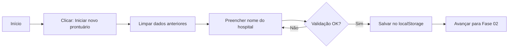
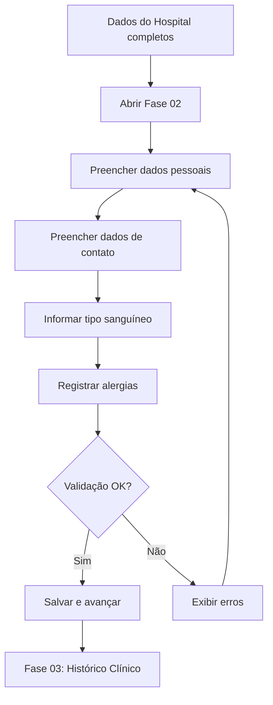
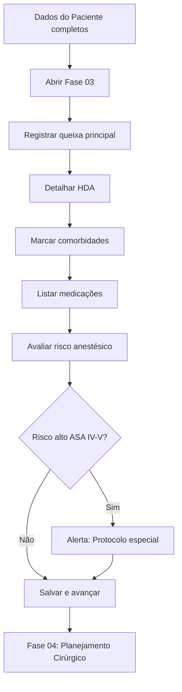
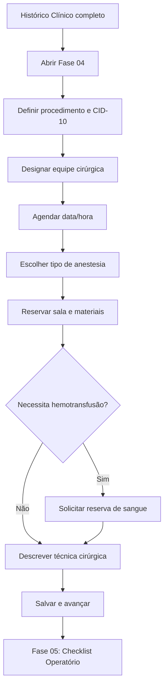
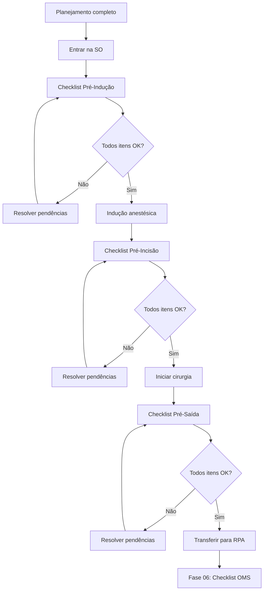
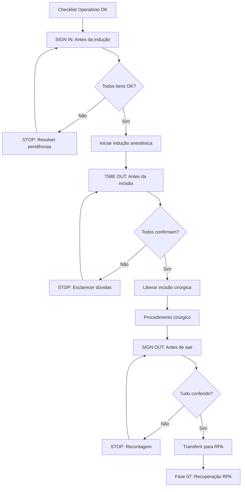
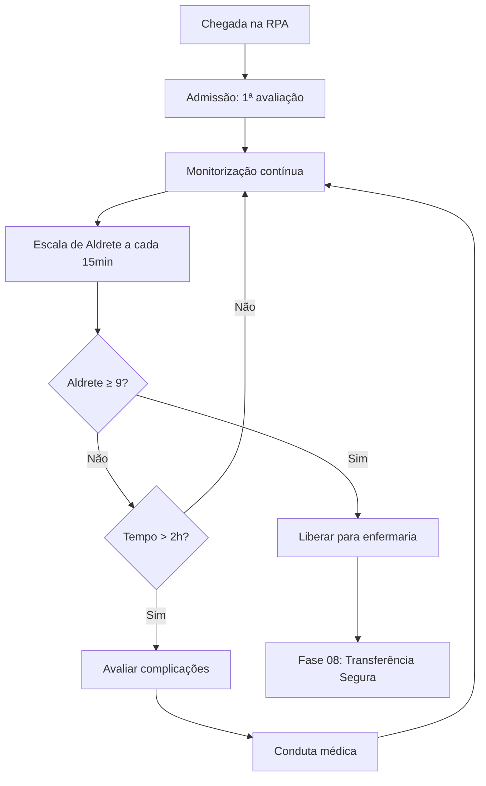
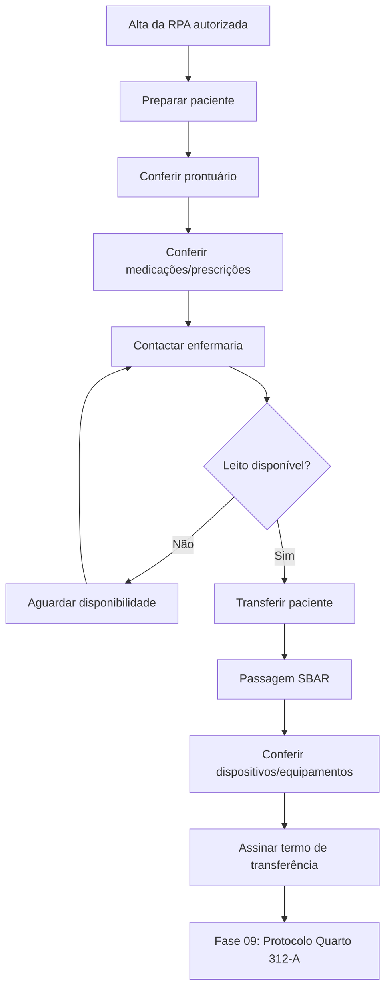
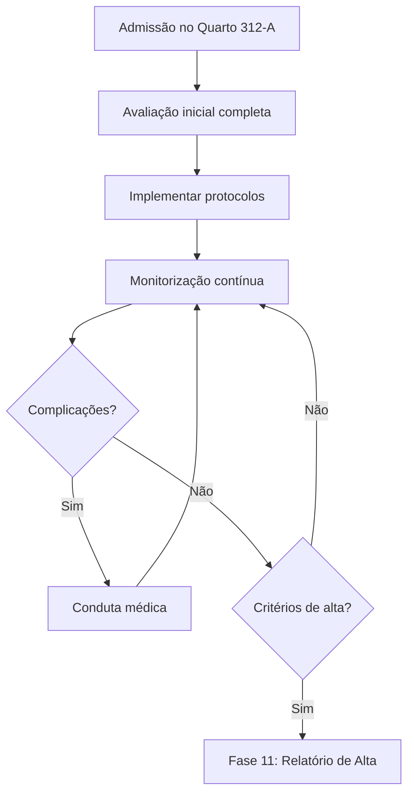

# 📋 Documentação das Fases do Prontuário Eletrônico

Este documento detalha cada uma das 12 fases obrigatórias do Sistema de Prontuário Eletrônico do Paciente (PEP), incluindo campos, validações, objetivos e fluxos de trabalho.

---

## Índice de Fases

1. [Fase 01 - Dados do Hospital](#fase-01---dados-do-hospital)
2. [Fase 02 - Dados do Paciente](#fase-02---dados-do-paciente)
3. [Fase 03 - Histórico Clínico](#fase-03---histórico-clínico)
4. [Fase 04 - Planejamento Cirúrgico](#fase-04---planejamento-cirúrgico)
5. [Fase 05 - Checklist Operatório](#fase-05---checklist-operatório)
6. [Fase 06 - Checklist de Cirurgia Segura (OMS)](#fase-06---checklist-de-cirurgia-segura-oms)
7. [Fase 07 - Recuperação Pós-Anestésica (RPA)](#fase-07---recuperação-pós-anestésica-rpa)
8. [Fase 08 - Transferência Segura para o Quarto](#fase-08---transferência-segura-para-o-quarto)
9. [Fase 09 - Protocolo de Segurança no Quarto 312-A](#fase-09---protocolo-de-segurança-no-quarto-312-a)
10. [Fase 10 - Sistema de Notificações Automáticas](#fase-10---sistema-de-notificações-automáticas)
11. [Fase 11 - Relatório de Alta Hospitalar](#fase-11---relatório-de-alta-hospitalar)
12. [Fase 12 - Finalização e Exportação](#fase-12---finalização-e-exportação)

---

## Fase 01 - Dados do Hospital

### 🎯 Objetivo
Registrar informações institucionais do hospital e iniciar um novo prontuário no sistema.

### 📄 Arquivo
`src/pages/index.html`

### 📝 Campos do Formulário

| Campo | Tipo | Obrigatório | Validação | Descrição |
|-------|------|-------------|-----------|-----------|
| Nome do Hospital | text | ✅ | minlength: 3 | Identificação completa da instituição |

### 🔄 Fluxo de Trabalho



### ⚙️ Funcionalidades Especiais

- **Botão "Iniciar novo prontuário"**: Limpa todos os dados salvos anteriormente
- **Auto-hidratação**: Carrega dados salvos ao reabrir a página
- **Persistência**: Dados salvos em `localStorage` com chave `form:index.html`

### 🔐 Regras de Negócio

1. Não permite avançar sem preencher o nome do hospital
2. Reiniciar prontuário requer confirmação do usuário
3. Primeira etapa do fluxo sequencial obrigatório

### 💾 Estrutura de Dados

```javascript
{
  "hospitalName": "Hospital NeoVida"
}
```

---

## Fase 02 - Dados do Paciente

### 🎯 Objetivo
Coletar informações demográficas e administrativas do paciente para identificação única no sistema.

### 📄 Arquivo
`src/pages/patient-data.html`

### 📝 Campos do Formulário

| Campo | Tipo | Obrigatório | Validação | Descrição |
|-------|------|-------------|-----------|-----------|
| Nome Completo | text | ✅ | minlength: 5 | Nome civil do paciente |
| CPF | text | ✅ | pattern: 000.000.000-00 | Documento de identificação |
| Data de Nascimento | date | ✅ | max: hoje | Data no formato DD/MM/AAAA |
| Sexo | select | ✅ | - | Masculino/Feminino/Outro |
| Endereço | text | ✅ | minlength: 10 | Endereço residencial completo |
| Telefone | tel | ✅ | pattern: (00) 00000-0000 | Contato principal |
| Email | email | ❌ | RFC 5322 | Contato alternativo |
| Tipo Sanguíneo | select | ✅ | - | A+, A-, B+, B-, AB+, AB-, O+, O- |
| Alergias | textarea | ❌ | - | Alergias medicamentosas/alimentares |
| Convênio | text | ✅ | - | Plano de saúde ou SUS |
| Número do Prontuário | text | ✅ | único | ID interno do hospital |

### 🔄 Fluxo de Trabalho



### ⚙️ Funcionalidades Especiais

- **Cálculo de Idade**: Automático a partir da data de nascimento
- **Validação de CPF**: Algoritmo de verificação de dígitos
- **Máscara de Entrada**: Formatação automática de CPF e telefone
- **Campo de Alergias**: Crítico para segurança do paciente

### 🔐 Regras de Negócio

1. CPF deve ser único no sistema (validação futura com backend)
2. Data de nascimento não pode ser futura
3. Tipo sanguíneo obrigatório para procedimentos cirúrgicos
4. Alergias devem ser destacadas em todas as etapas

### 💾 Estrutura de Dados

```javascript
{
  "patientName": "João da Silva",
  "cpf": "123.456.789-00",
  "birthDate": "1985-03-15",
  "gender": "Masculino",
  "address": "Rua das Flores, 123 - Centro",
  "phone": "(11) 98765-4321",
  "email": "joao.silva@email.com",
  "bloodType": "O+",
  "allergies": "Penicilina, Dipirona",
  "insurance": "Unimed Premium",
  "recordNumber": "PEP-2025-0001"
}
```

### ⚠️ Alertas e Notificações

- 🔴 **Alergias registradas**: Exibir alerta vermelho em todas as páginas
- 🟡 **Idade avançada (>80 anos)**: Protocolo de cuidados especiais
- 🟡 **Menores de 18 anos**: Requer responsável legal

---

## Fase 03 - Histórico Clínico

### 🎯 Objetivo
Documentar o histórico médico completo do paciente, incluindo condições pré-existentes, medicações em uso e cirurgias anteriores.

### 📄 Arquivo
`src/pages/clinical-history.html`

### 📝 Campos do Formulário

| Campo | Tipo | Obrigatório | Validação | Descrição |
|-------|------|-------------|-----------|-----------|
| Queixa Principal | textarea | ✅ | minlength: 10 | Motivo da internação |
| História da Doença Atual (HDA) | textarea | ✅ | minlength: 20 | Evolução dos sintomas |
| Comorbidades | checkbox-group | ❌ | - | Diabetes, HAS, Cardiopatias, etc. |
| Cirurgias Anteriores | textarea | ❌ | - | Procedimentos cirúrgicos prévios |
| Medicações em Uso | textarea | ✅ | - | Lista completa de medicamentos |
| Histórico Familiar | textarea | ❌ | - | Doenças hereditárias |
| Hábitos de Vida | checkbox-group | ❌ | - | Tabagismo, Etilismo, Drogas |
| Exames Pré-Operatórios | file-upload | ❌ | PDF/JPG | Hemograma, ECG, Raio-X, etc. |
| Avaliação Pré-Anestésica | select | ✅ | ASA I-V | Classificação ASA |

### 🔄 Fluxo de Trabalho



### ⚙️ Funcionalidades Especiais

- **Classificação ASA**: 
  - ASA I: Paciente saudável
  - ASA II: Doença sistêmica leve
  - ASA III: Doença sistêmica grave
  - ASA IV: Ameaça constante à vida
  - ASA V: Moribundo
- **Upload de Exames**: Suporte para múltiplos arquivos (futura implementação)
- **Checklist de Comorbidades**: Facilita preenchimento rápido

### 🔐 Regras de Negócio

1. Pacientes ASA IV-V requerem protocolo de cuidados intensivos
2. Medicações anticoagulantes devem ser destacadas
3. Cirurgias prévias no mesmo local aumentam risco cirúrgico
4. Histórico de reações anestésicas é crítico

### 💾 Estrutura de Dados

```javascript
{
  "chiefComplaint": "Dor abdominal intensa há 3 dias",
  "presentIllness": "Paciente relata início súbito...",
  "comorbidities": ["Diabetes Mellitus Tipo 2", "Hipertensão Arterial"],
  "previousSurgeries": "Apendicectomia (2010), Colecistectomia (2018)",
  "currentMedications": "Metformina 850mg 2x/dia, Losartana 50mg 1x/dia",
  "familyHistory": "Pai com história de IAM aos 55 anos",
  "habits": ["Ex-tabagista há 5 anos"],
  "preOpExams": ["hemograma.pdf", "ecg.jpg"],
  "asaClassification": "ASA II"
}
```

### ⚠️ Alertas e Notificações

- 🔴 **ASA IV-V**: Requer autorização de médico intensivista
- 🔴 **Anticoagulantes**: Protocolo de suspensão pré-operatória
- 🟡 **Múltiplas comorbidades**: Risco cirúrgico aumentado

---

## Fase 04 - Planejamento Cirúrgico

### 🎯 Objetivo
Definir detalhes do procedimento cirúrgico, equipe envolvida, materiais necessários e estratégias operatórias.

### 📄 Arquivo
`src/pages/surgical-planning.html`

### 📝 Campos do Formulário

| Campo | Tipo | Obrigatório | Validação | Descrição |
|-------|------|-------------|-----------|-----------|
| Tipo de Cirurgia | text | ✅ | - | Nome completo do procedimento |
| CID-10 | text | ✅ | pattern: [A-Z]\d{2}(\.\d)? | Código da doença |
| Cirurgião Responsável | text | ✅ | - | Nome e CRM |
| Equipe Cirúrgica | textarea | ✅ | - | Auxiliares, anestesista, instrumentador |
| Data/Hora Prevista | datetime-local | ✅ | > agora | Agendamento da cirurgia |
| Duração Estimada | time | ✅ | - | Tempo previsto em horas |
| Tipo de Anestesia | select | ✅ | - | Geral, Raqui, Local, Sedação |
| Sala Cirúrgica | select | ✅ | - | Número da sala |
| Materiais Especiais | textarea | ❌ | - | Próteses, implantes, equipamentos |
| Reserva de Sangue | select | ✅ | - | Sim/Não + quantidade |
| Posicionamento | select | ✅ | - | Supino, Prona, Lateral, etc. |
| Técnica Cirúrgica | textarea | ✅ | minlength: 50 | Descrição detalhada |

### 🔄 Fluxo de Trabalho



### ⚙️ Funcionalidades Especiais

- **Validação de CID-10**: Formato correto (ex: K40.9)
- **Disponibilidade de Sala**: Verificação de agenda (futura implementação)
- **Cálculo de Término**: Data/hora prevista de fim baseada na duração
- **Alerta de Materiais**: Notificação ao CME (Central de Material Esterilizado)

### 🔐 Regras de Negócio

1. Cirurgião responsável deve ter CRM ativo
2. Sala cirúrgica não pode estar ocupada no horário
3. Materiais especiais devem ser solicitados com antecedência mínima de 24h
4. Reserva de sangue requer compatibilidade ABO/Rh

### 💾 Estrutura de Dados

```javascript
{
  "surgeryType": "Colecistectomia Videolaparoscópica",
  "icd10": "K80.2",
  "surgeon": "Dr. Carlos Alberto - CRM 123456",
  "surgicalTeam": "1º Aux: Dr. João - CRM 789012\nAnestesista: Dra. Maria - CRM 345678\nInstrumentador: Téc. Pedro",
  "scheduledDateTime": "2025-10-25T08:00",
  "estimatedDuration": "02:30",
  "anesthesiaType": "Anestesia Geral",
  "operatingRoom": "Sala 3",
  "specialMaterials": "Kit de videolaparoscopia\nClipes metálicos",
  "bloodReserve": "Não",
  "positioning": "Supino",
  "surgicalTechnique": "Acesso por 4 portais: umbilical (10mm), epigástrio (10mm), hipocôndrio direito (5mm), flanco direito (5mm)..."
}
```

### ⚠️ Alertas e Notificações

- 🔴 **Cirurgia de emergência**: Prioridade absoluta
- 🟡 **Materiais especiais**: Confirmar disponibilidade no estoque
- 🟡 **Reserva de sangue**: Acionar banco de sangue com antecedência

---

## Fase 05 - Checklist Operatório

### 🎯 Objetivo
Garantir que todos os itens de segurança pré-operatórios sejam verificados antes do início do procedimento.

### 📄 Arquivo
`src/pages/surgical-checklist.html`

### 📝 Itens do Checklist

#### ✅ Antes da Indução Anestésica

| Item | Tipo | Responsável | Descrição |
|------|------|-------------|-----------|
| Identidade do paciente confirmada | checkbox | Enfermagem | Verificar nome completo, data de nascimento e prontuário |
| Local cirúrgico marcado | checkbox | Cirurgião | Marcação com caneta permanente |
| Consentimento informado assinado | checkbox | Médico | TCLE assinado pelo paciente/responsável |
| Jejum adequado | checkbox | Anestesista | Mínimo 8h para sólidos, 2h para líquidos claros |
| Próteses removidas | checkbox | Enfermagem | Dentaduras, óculos, lentes, aparelhos auditivos |
| Acesso venoso pérvio | checkbox | Enfermagem | Jelco calibroso para procedimentos longos |
| Equipamentos funcionando | checkbox | Técnico | Bisturi elétrico, aspirador, foco cirúrgico |

#### ✅ Antes da Incisão Cirúrgica

| Item | Tipo | Responsável | Descrição |
|------|------|-------------|-----------|
| Antibioticoprofilaxia administrada | checkbox | Anestesista | 30-60min antes da incisão |
| Plano anestésico confirmado | checkbox | Anestesista | Tipo, dosagens, monitorização |
| Posicionamento adequado | checkbox | Equipe | Coxins, faixas de segurança |
| Assepsia e antissepsia | checkbox | Enfermagem | Degermação e antissepsia com clorexidina alcoólica |
| Campos cirúrgicos estéreis | checkbox | Instrumentador | Colocação correta |
| Imagens disponíveis | checkbox | Cirurgião | Raio-X, TC, RM na sala |

#### ✅ Antes da Saída da Sala

| Item | Tipo | Responsável | Descrição |
|------|------|-------------|-----------|
| Contagem de compressas | checkbox | Instrumentador | Conferência final |
| Contagem de instrumentais | checkbox | Instrumentador | Nenhum item faltando |
| Identificação de peças anatômicas | checkbox | Cirurgião | Etiquetagem para anatomopatológico |
| Revisão de hemostasia | checkbox | Cirurgião | Ausência de sangramentos |
| Prescrição pós-operatória | checkbox | Cirurgião | Analgesia, antibióticos, cuidados |
| Orientações à RPA | checkbox | Anestesista | Informações sobre anestesia e intercorrências |

### 🔄 Fluxo de Trabalho



### ⚙️ Funcionalidades Especiais

- **Time-out Cirúrgico**: Pausa obrigatória antes da incisão
- **Assinatura Múltipla**: Cirurgião, anestesista e enfermeiro
- **Registro de Horários**: Timestamp de cada etapa
- **Bloqueio de Avanço**: Não permite prosseguir se algum item não foi checado

### 🔐 Regras de Negócio

1. Todos os itens devem ser checados obrigatoriamente
2. Qualquer pendência interrompe o procedimento
3. Registro de nome e CRM/COREN de quem preencheu
4. Não permite desmarcação de itens já checados

### 💾 Estrutura de Dados

```javascript
{
  "preInduction": {
    "patientIdentityConfirmed": { checked: true, timestamp: "2025-10-25T07:45:00", responsible: "Enf. Ana - COREN 12345" },
    "sitemarked": { checked: true, timestamp: "2025-10-25T07:50:00", responsible: "Dr. Carlos - CRM 123456" },
    "consentSigned": { checked: true, timestamp: "2025-10-25T07:30:00", responsible: "Dr. Carlos - CRM 123456" },
    // ...
  },
  "preIncision": {
    "antibioticsGiven": { checked: true, timestamp: "2025-10-25T08:05:00", responsible: "Dra. Maria - CRM 345678" },
    // ...
  },
  "preExit": {
    "spongeCountCorrect": { checked: true, timestamp: "2025-10-25T10:25:00", responsible: "Téc. Pedro" },
    // ...
  }
}
```

### ⚠️ Alertas e Notificações

- 🔴 **Item não checado**: Bloqueia início da etapa seguinte
- 🔴 **Contagem incorreta**: Não permite saída da sala
- 🟡 **Antibiótico não administrado**: Risco de infecção aumentado

---

## Fase 06 - Checklist de Cirurgia Segura (OMS)

### 🎯 Objetivo
Implementar o protocolo de cirurgia segura da Organização Mundial da Saúde, reduzindo complicações e mortalidade cirúrgica.

### 📄 Arquivo
`src/pages/who-safe-surgery-checklist.html`

### 📝 Três Momentos Críticos (WHO Surgical Safety Checklist)

#### 1️⃣ **SIGN IN** (Antes da Indução Anestésica)

| Item | Verificação |
|------|-------------|
| **Identificação do Paciente** | Confirmar verbalmente nome, data de nascimento e procedimento |
| **Sítio Cirúrgico Marcado** | Verificar marcação visível |
| **Equipamentos de Anestesia** | Checagem completa do carrinho de anestesia |
| **Oxímetro de Pulso** | Funcionamento e colocação adequada |
| **Alergias Conhecidas** | Alerta verbal para toda equipe |
| **Via Aérea Difícil / Risco de Aspiração** | Equipamentos de emergência disponíveis |
| **Risco de Perda Sanguínea > 500ml** | Acesso IV adequado + reserva de sangue |

#### 2️⃣ **TIME OUT** (Antes da Incisão Cirúrgica)

| Item | Verificação |
|------|-------------|
| **Confirmação de Todos os Membros** | Nome e função de cada membro da equipe |
| **Identificação do Paciente** | Confirmar verbalmente nome, procedimento e local |
| **Antibioticoprofilaxia** | Administrada nos últimos 60 minutos |
| **Imagens Essenciais** | Exames disponíveis e visualizados |
| **Eventos Críticos Cirurgião** | Passos críticos, duração, perda sanguínea esperada |
| **Eventos Críticos Anestesista** | Preocupações específicas do paciente |
| **Eventos Críticos Enfermagem** | Esterilidade confirmada, equipamentos funcionando |

#### 3️⃣ **SIGN OUT** (Antes de Sair da Sala)

| Item | Verificação |
|------|-------------|
| **Confirmação do Procedimento Realizado** | Registro verbal |
| **Contagem de Instrumentais Completa** | Conferência final: compressas, instrumentos, agulhas |
| **Identificação de Espécimes** | Etiquetagem com nome do paciente |
| **Problemas com Equipamentos** | Registrar qualquer falha |
| **Revisão dos Pontos-Chave** | Cirurgião, anestesista e enfermeiro revisam próximos cuidados |

### 🔄 Fluxo de Trabalho



### ⚙️ Funcionalidades Especiais

- **Pause Obrigatória**: Sistema exige confirmação verbal de toda equipe
- **Assinatura Digital**: Cirurgião, anestesista e enfermeiro devem assinar cada etapa
- **Registro de Horários**: Timestamp automático de cada momento
- **Alertas Sonoros**: Avisos quando tempo excede o esperado

### 🔐 Regras de Negócio

1. **Nenhuma etapa pode ser pulada**: Sequência rígida Sign In → Time Out → Sign Out
2. **Confirmação Verbal Obrigatória**: Não aceita checagem silenciosa
3. **Registro Permanente**: Armazenado no prontuário e não pode ser alterado posteriormente
4. **Todos os membros devem estar presentes**: Cirurgião, anestesista, instrumentador, circulante

### 💾 Estrutura de Dados

```javascript
{
  "whoChecklist": {
    "signIn": {
      "timestamp": "2025-10-25T07:55:00",
      "patientConfirmed": true,
      "siteMarked": true,
      "anesthesiaCheck": true,
      "pulseOximeter": true,
      "allergies": "Penicilina",
      "difficultAirway": false,
      "aspirationRisk": false,
      "bloodLossRisk": false,
      "signedBy": "Dra. Maria - CRM 345678"
    },
    "timeOut": {
      "timestamp": "2025-10-25T08:10:00",
      "teamIntroduction": true,
      "patientProcedureConfirmed": true,
      "antibioticsGiven": true,
      "imagingDisplayed": true,
      "surgeonCriticalSteps": "Dissecção cuidadosa do ducto cístico",
      "anesthesiaConcerns": "Nenhuma",
      "sterilityConfirmed": true,
      "signedBy": ["Dr. Carlos - CRM 123456", "Dra. Maria - CRM 345678", "Enf. Ana - COREN 12345"]
    },
    "signOut": {
      "timestamp": "2025-10-25T10:30:00",
      "procedureRecorded": "Colecistectomia Videolaparoscópica",
      "countsCorrect": true,
      "specimenLabeled": true,
      "equipmentProblems": "Nenhum",
      "keyReviewed": true,
      "signedBy": ["Dr. Carlos - CRM 123456", "Dra. Maria - CRM 345678", "Enf. Ana - COREN 12345"]
    }
  }
}
```

### 📊 Benefícios Comprovados (OMS)

- ✅ **Redução de 47% na mortalidade cirúrgica**
- ✅ **Redução de 36% nas complicações graves**
- ✅ **Redução de 50% nas infecções de sítio cirúrgico**
- ✅ **Melhora na comunicação da equipe**

### ⚠️ Alertas e Notificações

- 🔴 **Time Out não realizado**: Cirurgia não pode iniciar
- 🔴 **Contagem incorreta no Sign Out**: Paciente não pode sair da sala
- 🟡 **Antibiótico não administrado**: Risco de infecção aumentado
- 🟡 **Imagens não disponíveis**: Risco de erro de lado/local

---

## Fase 07 - Recuperação Pós-Anestésica (RPA)

### 🎯 Objetivo
Monitorar o paciente no período pós-operatório imediato, garantindo recuperação segura da anestesia antes da transferência para o quarto.

### 📄 Arquivo
`src/pages/rpa-recovery.html`

### 📝 Escala de Aldrete (Pontuação 0-10)

| Parâmetro | 0 pontos | 1 ponto | 2 pontos |
|-----------|----------|---------|----------|
| **Atividade Muscular** | Sem movimento | Move 2 extremidades | Move 4 extremidades |
| **Respiração** | Apneia | Dispneia/limitada | Respira/tosse livremente |
| **Circulação** | PA ±50% pré-op | PA ±20-50% pré-op | PA ±20% pré-op |
| **Consciência** | Não responde | Responde à chamada | Desperto |
| **Saturação O₂** | SpO₂ <90% c/ O₂ | SpO₂ >90% c/ O₂ | SpO₂ >92% s/ O₂ |

**Alta da RPA**: Pontuação ≥ 9

### 📝 Campos de Monitorização

| Campo | Tipo | Frequência | Valores Normais |
|-------|------|------------|-----------------|
| Pressão Arterial | number | 15/15min | 90-140 / 60-90 mmHg |
| Frequência Cardíaca | number | 15/15min | 60-100 bpm |
| Frequência Respiratória | number | 15/15min | 12-20 irpm |
| Saturação O₂ | number | 15/15min | >92% |
| Temperatura | number | 30/30min | 36-37.5°C |
| Dor (EVA 0-10) | number | 30/30min | <4 (aceitável) |
| Náuseas/Vômitos | select | Contínuo | Sim/Não |
| Nível de Sedação | select | 15/15min | Acordado/Sonolento/Sedado |
| Débito Urinário | number | Horário | >0.5ml/kg/h |
| Sangramentos | textarea | Contínuo | Descrição |

### 🔄 Fluxo de Trabalho



### ⚙️ Funcionalidades Especiais

- **Gráfico de Sinais Vitais**: Visualização em tempo real da evolução
- **Cálculo Automático Aldrete**: Pontuação atualizada a cada registro
- **Alertas de Parâmetros**: Notificação quando valores fora do esperado
- **Registro de Intercorrências**: Campo para eventos adversos

### 🔐 Regras de Negócio

1. **Alta apenas com Aldrete ≥ 9**: Exceto com justificativa médica documentada
2. **Permanência mínima**: 60 minutos, independente da pontuação
3. **Analgesia adequada**: EVA <4 antes da alta
4. **Náuseas controladas**: Não transferir paciente vomitando ativamente
5. **Acompanhamento médico**: Anestesista deve autorizar alta da RPA

### 💾 Estrutura de Dados

```javascript
{
  "rpaAdmission": {
    "arrivalTime": "2025-10-25T10:45:00",
    "receivedFrom": "SO 3 - Dr. Carlos",
    "initialAldrete": 6,
    "initialVitalSigns": {
      "bp": "120/80",
      "hr": 78,
      "rr": 16,
      "spo2": 95,
      "temp": 36.2
    }
  },
  "monitoring": [
    {
      "time": "2025-10-25T11:00:00",
      "aldrete": 7,
      "bp": "125/82",
      "hr": 75,
      "rr": 14,
      "spo2": 96,
      "painScore": 3,
      "sedation": "Sonolento",
      "nausea": false
    },
    {
      "time": "2025-10-25T11:15:00",
      "aldrete": 9,
      "bp": "118/78",
      "hr": 72,
      "rr": 16,
      "spo2": 97,
      "painScore": 2,
      "sedation": "Acordado",
      "nausea": false
    }
  ],
  "rpaDischarge": {
    "dischargeTime": "2025-10-25T11:30:00",
    "finalAldrete": 10,
    "destination": "Enfermaria 312-A",
    "authorizedBy": "Dra. Maria - CRM 345678"
  }
}
```

### ⚠️ Alertas e Notificações

- 🔴 **Aldrete <6 após 1h**: Avaliar complicações anestésicas
- 🔴 **SpO₂ <90%**: Suporte ventilatório imediato
- 🔴 **PA <90/60 ou >180/110**: Intervenção médica urgente
- 🟡 **Dor EVA >6**: Analgesia de resgate
- 🟡 **Náuseas persistentes**: Antiemético

### 📊 Complicações Comuns na RPA

| Complicação | Incidência | Conduta |
|-------------|------------|---------|
| Náuseas/Vômitos | 20-30% | Ondansetrona 4mg IV |
| Dor moderada/intensa | 30-40% | Morfina 2-5mg IV |
| Hipotensão | 5-10% | Reposição volêmica |
| Obstrução de vias aéreas | 1-2% | Cânula de Guedel / IOT |
| Hipotermia | 10-20% | Manta térmica |

---

## Fase 08 - Transferência Segura para o Quarto

### 🎯 Objetivo
Garantir transição segura do paciente da RPA para a enfermaria, com passagem completa de informações e continuidade dos cuidados.

### 📄 Arquivo
`src/pages/safe-transfer-room.html`

### 📝 Protocolo SBAR (Situation-Background-Assessment-Recommendation)

#### 🔵 **S - Situação**
| Item | Descrição |
|------|-----------|
| Nome do Paciente | Identificação completa |
| Procedimento Realizado | Nome da cirurgia |
| Cirurgião Responsável | Nome e CRM |
| Data/Hora da Cirurgia | Timestamp |
| Destino | Quarto/Leito |

#### 🔵 **B - Background (Histórico)**
| Item | Descrição |
|------|-----------|
| Diagnóstico | CID-10 |
| Comorbidades | Lista de doenças prévias |
| Alergias | Destacar em vermelho |
| Medicações em Uso | Lista completa |
| Tipo Sanguíneo | ABO/Rh |

#### 🔵 **A - Assessment (Avaliação)**
| Item | Descrição |
|------|-----------|
| Aldrete na Saída | Pontuação final |
| Sinais Vitais Atuais | PA, FC, FR, SpO₂, Tax |
| Nível de Consciência | Glasgow ou AVDN |
| Dor | EVA 0-10 |
| Dispositivos | Drenos, sondas, cateteres, O₂ |
| Curativos | Localização e aspecto |
| Intercorrências | Eventos adversos durante cirurgia/RPA |

#### 🔵 **R - Recomendações**
| Item | Descrição |
|------|-----------|
| Prescrição Médica | Medicações, dieta, hidratação |
| Cuidados de Enfermagem | SSVV, curativos, mobilização |
| Sinais de Alerta | O que observar (sangramento, dispneia, etc.) |
| Próxima Reavaliação | Horário da visita médica |

### 🔄 Fluxo de Trabalho



### ⚙️ Funcionalidades Especiais

- **Checklist de Transferência**: 15 itens obrigatórios
- **Passagem Estruturada SBAR**: Campos guiados
- **Assinatura Dupla**: Enfermeiro da RPA + Enfermeiro da Enfermaria
- **Registro Fotográfico de Curativos**: (Futura implementação)
- **QR Code do Paciente**: Acesso rápido ao prontuário digital

### 📋 Checklist de Transferência Segura

| Item | Verificação |
|------|-------------|
| ☐ | Paciente identificado com pulseira |
| ☐ | Prontuário completo |
| ☐ | Prescrição médica transcrita |
| ☐ | Radiografia/exames no prontuário |
| ☐ | Aldrete ≥ 9 documentado |
| ☐ | Sinais vitais estáveis |
| ☐ | Dor controlada (EVA <4) |
| ☐ | Acessos venosos pérvios |
| ☐ | Drenos fixados e funcionantes |
| ☐ | Sondas identificadas |
| ☐ | Curativos limpos e secos |
| ☐ | Equipamentos funcionando (oxigênio, monitor) |
| ☐ | Pertences do paciente conferidos |
| ☐ | Familiares informados |
| ☐ | Passagem SBAR realizada |

### 🔐 Regras de Negócio

1. **Não transferir sem Aldrete ≥ 9**: Exceto com justificativa médica
2. **Passagem SBAR obrigatória**: Não aceita transferência silenciosa
3. **Dupla conferência**: Dois profissionais checam itens críticos
4. **Registro de horários**: Saída da RPA e chegada na enfermaria
5. **Comunicação de intercorrências**: Destaques em vermelho

### 💾 Estrutura de Dados

```javascript
{
  "transferInfo": {
    "transferDate": "2025-10-25T11:45:00",
    "fromUnit": "RPA",
    "toUnit": "Enfermaria 3º Andar",
    "room": "312-A",
    "bed": "Leito 1"
  },
  "sbar": {
    "situation": {
      "patientName": "João da Silva",
      "procedure": "Colecistectomia Videolaparoscópica",
      "surgeon": "Dr. Carlos - CRM 123456",
      "surgeryDateTime": "2025-10-25T08:00:00"
    },
    "background": {
      "diagnosis": "K80.2 - Cálculo de vesícula biliar sem colecistite",
      "comorbidities": ["Diabetes Mellitus Tipo 2", "HAS"],
      "allergies": "Penicilina",
      "medications": ["Metformina 850mg", "Losartana 50mg"],
      "bloodType": "O+"
    },
    "assessment": {
      "aldrete": 10,
      "vitalSigns": { "bp": "118/75", "hr": 70, "rr": 14, "spo2": 98, "temp": 36.5 },
      "consciousness": "Acordado e orientado",
      "painScore": 2,
      "devices": ["Jelco 20G em MSE", "Dreno de Penrose"],
      "dressing": "Curativo limpo e seco em 4 portais",
      "complications": "Nenhuma"
    },
    "recommendations": {
      "prescription": "Dipirona 1g 6/6h, Morfina 2mg SN",
      "nursingCare": "SSVV 4/4h, Curativo diário, Deambulação precoce",
      "alerts": "Observar débito do dreno e sinais de sangramento",
      "nextEvaluation": "Visita cirúrgica às 17h"
    }
  },
  "checklist": {
    "patientBandIdentified": true,
    "recordComplete": true,
    // ... todos os 15 itens
  },
  "signatures": {
    "rpaNurse": "Enf. Ana - COREN 12345",
    "wardNurse": "Enf. Paula - COREN 67890",
    "timestamp": "2025-10-25T11:50:00"
  }
}
```

### ⚠️ Alertas e Notificações

- 🔴 **Checklist incompleto**: Não permite transferência
- 🔴 **Sinais vitais instáveis**: Retornar para RPA
- 🟡 **Dreno com débito >100ml/h**: Alertar cirurgião
- 🟡 **Dor EVA >4**: Analgesia antes da transferência

---

## Fase 09 - Protocolo de Segurança no Quarto 312-A

### 🎯 Objetivo
Implementar cuidados de enfermagem específicos no pós-operatório, prevenindo complicações e garantindo recuperação segura.

### 📄 Arquivo
`src/pages/room-312a-safety-protocol.html`

### 📝 Protocolos de Cuidados

#### 🛡️ **Prevenção de Quedas**

| Medida | Frequência | Responsável |
|--------|------------|-------------|
| Avaliação de Risco (Morse Fall Scale) | Admissão + diária | Enfermagem |
| Grades do leito elevadas | Contínuo | Enfermagem |
| Campainha ao alcance | Contínuo | Enfermagem |
| Calçado antiderrapante | Contínuo | Paciente/Família |
| Ambiente iluminado | Noturno | Enfermagem |
| Acompanhante na deambulação | Sempre | Familiar/Enfermagem |

**Morse Fall Scale**:
- História de quedas: 25 pontos
- Diagnóstico secundário: 15 pontos
- Auxílio na deambulação: 0-30 pontos
- Terapia IV/dispositivos: 20 pontos
- Marcha: 0-20 pontos
- Estado mental: 0-15 pontos

**Risco**: Baixo (<25), Moderado (25-50), Alto (>50)

#### 💉 **Prevenção de Infecção de Sítio Cirúrgico (ISC)**

| Medida | Frequência | Descrição |
|--------|------------|-----------|
| Higienização das mãos | Sempre | Álcool gel 70% ou água e sabão |
| Curativo estéril | Diário ou se sujo | Técnica asséptica rigorosa |
| Observação de sinais flogísticos | 8/8h | Rubor, calor, tumor, dor, secreção |
| Antibioticoterapia profilática | Conforme prescrição | Manter horários rigorosos |
| Banho diário | 1x/dia | Sabonete neutro, evitar molhar curativo |
| Orientação ao paciente | Contínuo | Não tocar no curativo, lavar as mãos |

**Sinais de ISC**:
- 🔴 Febre >38°C após 48h
- 🔴 Secreção purulenta
- 🔴 Deiscência de sutura
- 🟡 Dor progressiva
- 🟡 Edema/eritema ao redor da incisão

#### 🩸 **Prevenção de Tromboembolismo Venoso (TEV)**

| Medida | Frequência | Descrição |
|--------|------------|-----------|
| Avaliação de Risco (Caprini) | Admissão | Estratificar risco de TEV |
| Deambulação precoce | 6/6h | Iniciar 6-8h pós-op |
| Exercícios no leito | 2/2h | Flexão/extensão de MMII |
| Hidratação adequada | Contínuo | Manter balanço hídrico positivo |
| Meias de compressão | Contínuo | Até deambulação plena |
| Heparina profilática | Conforme prescrição | HBPM SC 1x/dia |

**Sinais de TVP**:
- 🔴 Dor em panturrilha
- 🔴 Edema unilateral de MMII
- 🔴 Empastamento muscular
- 🔴 Sinal de Homans positivo

#### 🫁 **Prevenção de Complicações Respiratórias**

| Medida | Frequência | Descrição |
|--------|------------|-----------|
| Espirometria de incentivo | 10x a cada 2h | Prevenir atelectasia |
| Tosse dirigida | 4/4h | Higiene brônquica |
| Mudança de decúbito | 2/2h | Evitar áreas de hipoventilação |
| Cabeceira elevada 30-45° | Contínuo | Facilita expansão pulmonar |
| Ausculta pulmonar | 8/8h | Detectar ruídos adventícios |
| Oxigenoterapia se SpO₂ <92% | SN | Cateter nasal ou máscara |

#### 🍽️ **Nutrição e Hidratação**

| Fase | Dieta | Progressão |
|------|-------|------------|
| POI dia 0 | Jejum | Líquidos claros se ruídos hidroaéreos |
| POI dia 1 | Líquidos claros | 6-8h após, se tolerância |
| POI dia 2 | Líquida completa | Aceitação >50% da dieta anterior |
| POI dia 3 | Branda | Sem náuseas/vômitos |
| POI dia 4 | Geral | Liberação conforme aceitação |

**Controles**:
- 📊 Balanço hídrico (entrada/saída)
- 📊 Aceitação alimentar (%)
- 📊 Peso diário
- 📊 Controle glicêmico (diabéticos)

### 🔄 Fluxo de Trabalho



### ⚙️ Funcionalidades Especiais

- **Dashboard de Protocolos**: Visualização do cumprimento de cada protocolo
- **Checklist Diário**: 50+ itens de cuidados
- **Gráfico de Evolução**: Sinais vitais, dor, deambulação
- **Alertas Automáticos**: Notificação quando protocolo não cumprido

### 🔐 Regras de Negócio

1. **Protocolos obrigatórios**: Não podem ser desativados
2. **Registro de não conformidade**: Justificativa obrigatória se protocolo não cumprido
3. **Revisão diária**: Enfermeiro responsável revisa cumprimento
4. **Indicadores de qualidade**: Métricas de adesão aos protocolos

### 💾 Estrutura de Dados

```javascript
{
  "room312A": {
    "admissionDate": "2025-10-25T12:00:00",
    "fallPrevention": {
      "morseScore": 35,
      "riskLevel": "Moderado",
      "measures": {
        "bedrailsUp": true,
        "bellWithinReach": true,
        "nonSlipFootwear": true,
        "accompaniedAmbulation": true
      }
    },
    "iscPrevention": {
      "dressingChanges": [
        { "date": "2025-10-26", "aspect": "Limpo e seco", "nurse": "Enf. Paula" },
        { "date": "2025-10-27", "aspect": "Limpo e seco", "nurse": "Enf. Laura" }
      ],
      "signsOfInfection": false
    },
    "tevPrevention": {
      "capriniScore": 7,
      "riskLevel": "Moderado",
      "ambulation": [
        { "date": "2025-10-25", "time": "18:00", "distance": "10 passos no corredor" },
        { "date": "2025-10-26", "time": "08:00", "distance": "Ida ao banheiro" }
      ],
      "compressionStockings": true,
      "heparin": true
    },
    "respiratoryCare": {
      "incentiveSpirometry": { "frequency": "10x a cada 2h", "compliance": "80%" },
      "positionChanges": { "frequency": "2/2h", "compliance": "100%" },
      "chestAuscultation": [
        { "time": "2025-10-25T20:00", "findings": "MV+ sem RA", "nurse": "Enf. Paula" }
      ]
    },
    "nutrition": {
      "currentDiet": "Líquida completa",
      "acceptance": "75%",
      "fluidBalance": { "input": 1800, "output": 1200, "balance": "+600ml" }
    }
  }
}
```

### ⚠️ Alertas e Notificações

- 🔴 **Morse >50**: Risco alto de queda - protocolo intensificado
- 🔴 **Sinais de ISC**: Alertar cirurgião imediatamente
- 🔴 **Sinais de TVP**: Doppler de MMII urgente
- 🟡 **Não deambulação em 12h**: Intensificar mobilização
- 🟡 **Aceitação alimentar <50%**: Avaliar causas

---

## Fase 10 - Sistema de Notificações Automáticas

### 🎯 Objetivo
Centralizar comunicação entre equipe multidisciplinar, alertar sobre eventos críticos e registrar todas as notificações do prontuário.

### 📄 Arquivo
`src/pages/automatic-notification.html`

### 📝 Tipos de Notificações

#### 🔔 **Notificações em Tempo Real**

| Tipo | Prioridade | Destinatário | Descrição |
|------|-----------|--------------|-----------|
| 🔴 **Crítica** | Imediata | Médico + Enfermagem | Emergência médica |
| 🟠 **Urgente** | <15min | Equipe responsável | Intercorrência que requer atenção |
| 🟡 **Importante** | <1h | Equipe responsável | Alteração significativa no quadro |
| 🟢 **Informativa** | <4h | Todos envolvidos | Atualização de rotina |

#### 📋 **Eventos que Geram Notificação Automática**

##### 🔴 Críticas (Imediatas)

```javascript
{
  "criticalNotifications": [
    { "event": "PA < 90/60 ou > 180/110", "action": "Médico em 5min" },
    { "event": "SpO₂ < 90%", "action": "Suporte ventilatório" },
    { "event": "FC < 50 ou > 120", "action": "ECG + avaliação médica" },
    { "event": "Queda do leito", "action": "Avaliação neurológica" },
    { "event": "Sangramento ativo", "action": "Cirurgião + hemostasia" },
    { "event": "Reação transfusional", "action": "Suspender transfusão" },
    { "event": "Parada cardiorrespiratória", "action": "Código azul" }
  ]
}
```

##### 🟠 Urgentes (<15min)

```javascript
{
  "urgentNotifications": [
    { "event": "Dor EVA > 7", "action": "Analgesia de resgate" },
    { "event": "Febre > 38.5°C", "action": "Hemoculturas + antibiótico" },
    { "event": "Débito de dreno > 200ml/h", "action": "Avaliar sangramento" },
    { "event": "Oligúria < 0.5ml/kg/h", "action": "Balanço hídrico + diurético" },
    { "event": "Glicemia < 70 ou > 250", "action": "Correção de insulina" },
    { "event": "Agitação psicomotora", "action": "Sedação + contenção" }
  ]
}
```

##### 🟡 Importantes (<1h)

```javascript
{
  "importantNotifications": [
    { "event": "Náuseas/vômitos persistentes", "action": "Antiemético" },
    { "event": "Não deambulou em 12h", "action": "Fisioterapia" },
    { "event": "Aceitação alimentar < 30%", "action": "Nutrição" },
    { "event": "Curativo com sangramento", "action": "Trocar curativo" },
    { "event": "Morse Fall Scale > 50", "action": "Intensificar prevenção" },
    { "event": "Sinais de infecção no curativo", "action": "Cultura + ATB" }
  ]
}
```

##### 🟢 Informativas

```javascript
{
  "informativeNotifications": [
    { "event": "Alta da RPA autorizada", "recipient": "Enfermaria" },
    { "event": "Exames laboratoriais disponíveis", "recipient": "Médico" },
    { "event": "Familiar solicitando informações", "recipient": "Enfermagem" },
    { "event": "Medicação prescrita não disponível", "recipient": "Farmácia" },
    { "event": "Agendamento de exame de imagem", "recipient": "Paciente" },
    { "event": "Próxima dose de antibiótico", "recipient": "Enfermagem" }
  ]
}
```

### 🔄 Fluxo de Trabalho

```mermaid
graph TD
    A[Evento detectado] --> B{Tipo de evento?}
    B -->|Crítico| C[Notificação imediata]
    B -->|Urgente| D[Notificação <15min]
    B -->|Importante| E[Notificação <1h]
    B -->|Informativo| F[Notificação <4h]
    C --> G[Médico + Enfermagem]
    D --> H[Equipe responsável]
    E --> H
    F --> I[Todos envolvidos]
    G --> J[Registrar ação tomada]
    H --> J
    I --> J
    J --> K[Atualizar status]
    K --> L{Resolvido?}
    L -->|Não| M[Escalar// filepath: c:\Users\rodrigo.eufrasio\Documents\Programação\_webbapp.pep\medical-record-web-app\docs\FASES.md
# 📋 Documentação das Fases do Prontuário Eletrônico

Este documento detalha cada uma das 12 fases obrigatórias do Sistema de Prontuário Eletrônico do Paciente (PEP), incluindo campos, validações, objetivos e fluxos de trabalho.

---

## Índice de Fases

1. [Fase 01 - Dados do Hospital](#fase-01---dados-do-hospital)
2. [Fase 02 - Dados do Paciente](#fase-02---dados-do-paciente)
3. [Fase 03 - Histórico Clínico](#fase-03---histórico-clínico)
4. [Fase 04 - Planejamento Cirúrgico](#fase-04---planejamento-cirúrgico)
5. [Fase 05 - Checklist Operatório](#fase-05---checklist-operatório)
6. [Fase 06 - Checklist de Cirurgia Segura (OMS)](#fase-06---checklist-de-cirurgia-segura-oms)
7. [Fase 07 - Recuperação Pós-Anestésica (RPA)](#fase-07---recuperação-pós-anestésica-rpa)
8. [Fase 08 - Transferência Segura para o Quarto](#fase-08---transferência-segura-para-o-quarto)
9. [Fase 09 - Protocolo de Segurança no Quarto 312-A](#fase-09---protocolo-de-segurança-no-quarto-312-a)
10. [Fase 10 - Sistema de Notificações Automáticas](#fase-10---sistema-de-notificações-automáticas)
11. [Fase 11 - Relatório de Alta Hospitalar](#fase-11---relatório-de-alta-hospitalar)
12. [Fase 12 - Finalização e Exportação](#fase-12---finalização-e-exportação)

---

## Fase 01 - Dados do Hospital

### 🎯 Objetivo
Registrar informações institucionais do hospital e iniciar um novo prontuário no sistema.

### 📄 Arquivo
`src/pages/index.html`

### 📝 Campos do Formulário

| Campo | Tipo | Obrigatório | Validação | Descrição |
|-------|------|-------------|-----------|-----------|
| Nome do Hospital | text | ✅ | minlength: 3 | Identificação completa da instituição |

### 🔄 Fluxo de Trabalho

```mermaid
graph LR
    A[Início] --> B[Clicar: Iniciar novo prontuário]
    B --> C[Limpar dados anteriores]
    C --> D[Preencher nome do hospital]
    D --> E{Validação OK?}
    E -->|Sim| F[Salvar no localStorage]
    F --> G[Avançar para Fase 02]
    E -->|Não| D
```

### ⚙️ Funcionalidades Especiais

- **Botão "Iniciar novo prontuário"**: Limpa todos os dados salvos anteriormente
- **Auto-hidratação**: Carrega dados salvos ao reabrir a página
- **Persistência**: Dados salvos em `localStorage` com chave `form:index.html`

### 🔐 Regras de Negócio

1. Não permite avançar sem preencher o nome do hospital
2. Reiniciar prontuário requer confirmação do usuário
3. Primeira etapa do fluxo sequencial obrigatório

### 💾 Estrutura de Dados

```javascript
{
  "hospitalName": "Hospital NeoVida"
}
```

---

## Fase 02 - Dados do Paciente

### 🎯 Objetivo
Coletar informações demográficas e administrativas do paciente para identificação única no sistema.

### 📄 Arquivo
`src/pages/patient-data.html`

### 📝 Campos do Formulário

| Campo | Tipo | Obrigatório | Validação | Descrição |
|-------|------|-------------|-----------|-----------|
| Nome Completo | text | ✅ | minlength: 5 | Nome civil do paciente |
| CPF | text | ✅ | pattern: 000.000.000-00 | Documento de identificação |
| Data de Nascimento | date | ✅ | max: hoje | Data no formato DD/MM/AAAA |
| Sexo | select | ✅ | - | Masculino/Feminino/Outro |
| Endereço | text | ✅ | minlength: 10 | Endereço residencial completo |
| Telefone | tel | ✅ | pattern: (00) 00000-0000 | Contato principal |
| Email | email | ❌ | RFC 5322 | Contato alternativo |
| Tipo Sanguíneo | select | ✅ | - | A+, A-, B+, B-, AB+, AB-, O+, O- |
| Alergias | textarea | ❌ | - | Alergias medicamentosas/alimentares |
| Convênio | text | ✅ | - | Plano de saúde ou SUS |
| Número do Prontuário | text | ✅ | único | ID interno do hospital |

### 🔄 Fluxo de Trabalho


### ⚙️ Funcionalidades Especiais

- **Cálculo de Idade**: Automático a partir da data de nascimento
- **Validação de CPF**: Algoritmo de verificação de dígitos
- **Máscara de Entrada**: Formatação automática de CPF e telefone
- **Campo de Alergias**: Crítico para segurança do paciente

### 🔐 Regras de Negócio

1. CPF deve ser único no sistema (validação futura com backend)
2. Data de nascimento não pode ser futura
3. Tipo sanguíneo obrigatório para procedimentos cirúrgicos
4. Alergias devem ser destacadas em todas as etapas

### 💾 Estrutura de Dados

```javascript
{
  "patientName": "João da Silva",
  "cpf": "123.456.789-00",
  "birthDate": "1985-03-15",
  "gender": "Masculino",
  "address": "Rua das Flores, 123 - Centro",
  "phone": "(11) 98765-4321",
  "email": "joao.silva@email.com",
  "bloodType": "O+",
  "allergies": "Penicilina, Dipirona",
  "insurance": "Unimed Premium",
  "recordNumber": "PEP-2025-0001"
}
```

### ⚠️ Alertas e Notificações

- 🔴 **Alergias registradas**: Exibir alerta vermelho em todas as páginas
- 🟡 **Idade avançada (>80 anos)**: Protocolo de cuidados especiais
- 🟡 **Menores de 18 anos**: Requer responsável legal

---

## Fase 03 - Histórico Clínico

### 🎯 Objetivo
Documentar o histórico médico completo do paciente, incluindo condições pré-existentes, medicações em uso e cirurgias anteriores.

### 📄 Arquivo
`src/pages/clinical-history.html`

### 📝 Campos do Formulário

| Campo | Tipo | Obrigatório | Validação | Descrição |
|-------|------|-------------|-----------|-----------|
| Queixa Principal | textarea | ✅ | minlength: 10 | Motivo da internação |
| História da Doença Atual (HDA) | textarea | ✅ | minlength: 20 | Evolução dos sintomas |
| Comorbidades | checkbox-group | ❌ | - | Diabetes, HAS, Cardiopatias, etc. |
| Cirurgias Anteriores | textarea | ❌ | - | Procedimentos cirúrgicos prévios |
| Medicações em Uso | textarea | ✅ | - | Lista completa de medicamentos |
| Histórico Familiar | textarea | ❌ | - | Doenças hereditárias |
| Hábitos de Vida | checkbox-group | ❌ | - | Tabagismo, Etilismo, Drogas |
| Exames Pré-Operatórios | file-upload | ❌ | PDF/JPG | Hemograma, ECG, Raio-X, etc. |
| Avaliação Pré-Anestésica | select | ✅ | ASA I-V | Classificação ASA |

### 🔄 Fluxo de Trabalho


### ⚙️ Funcionalidades Especiais

- **Classificação ASA**: 
  - ASA I: Paciente saudável
  - ASA II: Doença sistêmica leve
  - ASA III: Doença sistêmica grave
  - ASA IV: Ameaça constante à vida
  - ASA V: Moribundo
- **Upload de Exames**: Suporte para múltiplos arquivos (futura implementação)
- **Checklist de Comorbidades**: Facilita preenchimento rápido

### 🔐 Regras de Negócio

1. Pacientes ASA IV-V requerem protocolo de cuidados intensivos
2. Medicações anticoagulantes devem ser destacadas
3. Cirurgias prévias no mesmo local aumentam risco cirúrgico
4. Histórico de reações anestésicas é crítico

### 💾 Estrutura de Dados

```javascript
{
  "chiefComplaint": "Dor abdominal intensa há 3 dias",
  "presentIllness": "Paciente relata início súbito...",
  "comorbidities": ["Diabetes Mellitus Tipo 2", "Hipertensão Arterial"],
  "previousSurgeries": "Apendicectomia (2010), Colecistectomia (2018)",
  "currentMedications": "Metformina 850mg 2x/dia, Losartana 50mg 1x/dia",
  "familyHistory": "Pai com história de IAM aos 55 anos",
  "habits": ["Ex-tabagista há 5 anos"],
  "preOpExams": ["hemograma.pdf", "ecg.jpg"],
  "asaClassification": "ASA II"
}
```

### ⚠️ Alertas e Notificações

- 🔴 **ASA IV-V**: Requer autorização de médico intensivista
- 🔴 **Anticoagulantes**: Protocolo de suspensão pré-operatória
- 🟡 **Múltiplas comorbidades**: Risco cirúrgico aumentado

---

## Fase 04 - Planejamento Cirúrgico

### 🎯 Objetivo
Definir detalhes do procedimento cirúrgico, equipe envolvida, materiais necessários e estratégias operatórias.

### 📄 Arquivo
`src/pages/surgical-planning.html`

### 📝 Campos do Formulário

| Campo | Tipo | Obrigatório | Validação | Descrição |
|-------|------|-------------|-----------|-----------|
| Tipo de Cirurgia | text | ✅ | - | Nome completo do procedimento |
| CID-10 | text | ✅ | pattern: [A-Z]\d{2}(\.\d)? | Código da doença |
| Cirurgião Responsável | text | ✅ | - | Nome e CRM |
| Equipe Cirúrgica | textarea | ✅ | - | Auxiliares, anestesista, instrumentador |
| Data/Hora Prevista | datetime-local | ✅ | > agora | Agendamento da cirurgia |
| Duração Estimada | time | ✅ | - | Tempo previsto em horas |
| Tipo de Anestesia | select | ✅ | - | Geral, Raqui, Local, Sedação |
| Sala Cirúrgica | select | ✅ | - | Número da sala |
| Materiais Especiais | textarea | ❌ | - | Próteses, implantes, equipamentos |
| Reserva de Sangue | select | ✅ | - | Sim/Não + quantidade |
| Posicionamento | select | ✅ | - | Supino, Prona, Lateral, etc. |
| Técnica Cirúrgica | textarea | ✅ | minlength: 50 | Descrição detalhada |

### 🔄 Fluxo de Trabalho


### ⚙️ Funcionalidades Especiais

- **Validação de CID-10**: Formato correto (ex: K40.9)
- **Disponibilidade de Sala**: Verificação de agenda (futura implementação)
- **Cálculo de Término**: Data/hora prevista de fim baseada na duração
- **Alerta de Materiais**: Notificação ao CME (Central de Material Esterilizado)

### 🔐 Regras de Negócio

1. Cirurgião responsável deve ter CRM ativo
2. Sala cirúrgica não pode estar ocupada no horário
3. Materiais especiais devem ser solicitados com antecedência mínima de 24h
4. Reserva de sangue requer compatibilidade ABO/Rh

### 💾 Estrutura de Dados

```javascript
{
  "surgeryType": "Colecistectomia Videolaparoscópica",
  "icd10": "K80.2",
  "surgeon": "Dr. Carlos Alberto - CRM 123456",
  "surgicalTeam": "1º Aux: Dr. João - CRM 789012\nAnestesista: Dra. Maria - CRM 345678\nInstrumentador: Téc. Pedro",
  "scheduledDateTime": "2025-10-25T08:00",
  "estimatedDuration": "02:30",
  "anesthesiaType": "Anestesia Geral",
  "operatingRoom": "Sala 3",
  "specialMaterials": "Kit de videolaparoscopia\nClipes metálicos",
  "bloodReserve": "Não",
  "positioning": "Supino",
  "surgicalTechnique": "Acesso por 4 portais: umbilical (10mm), epigástrio (10mm), hipocôndrio direito (5mm), flanco direito (5mm)..."
}
```

### ⚠️ Alertas e Notificações

- 🔴 **Cirurgia de emergência**: Prioridade absoluta
- 🟡 **Materiais especiais**: Confirmar disponibilidade no estoque
- 🟡 **Reserva de sangue**: Acionar banco de sangue com antecedência

---

## Fase 05 - Checklist Operatório

### 🎯 Objetivo
Garantir que todos os itens de segurança pré-operatórios sejam verificados antes do início do procedimento.

### 📄 Arquivo
`src/pages/surgical-checklist.html`

### 📝 Itens do Checklist

#### ✅ Antes da Indução Anestésica

| Item | Tipo | Responsável | Descrição |
|------|------|-------------|-----------|
| Identidade do paciente confirmada | checkbox | Enfermagem | Verificar nome completo, data de nascimento e prontuário |
| Local cirúrgico marcado | checkbox | Cirurgião | Marcação com caneta permanente |
| Consentimento informado assinado | checkbox | Médico | TCLE assinado pelo paciente/responsável |
| Jejum adequado | checkbox | Anestesista | Mínimo 8h para sólidos, 2h para líquidos claros |
| Próteses removidas | checkbox | Enfermagem | Dentaduras, óculos, lentes, aparelhos auditivos |
| Acesso venoso pérvio | checkbox | Enfermagem | Jelco calibroso para procedimentos longos |
| Equipamentos funcionando | checkbox | Técnico | Bisturi elétrico, aspirador, foco cirúrgico |

#### ✅ Antes da Incisão Cirúrgica

| Item | Tipo | Responsável | Descrição |
|------|------|-------------|-----------|
| Antibioticoprofilaxia administrada | checkbox | Anestesista | 30-60min antes da incisão |
| Plano anestésico confirmado | checkbox | Anestesista | Tipo, dosagens, monitorização |
| Posicionamento adequado | checkbox | Equipe | Coxins, faixas de segurança |
| Assepsia e antissepsia | checkbox | Enfermagem | Degermação e antissepsia com clorexidina alcoólica |
| Campos cirúrgicos estéreis | checkbox | Instrumentador | Colocação correta |
| Imagens disponíveis | checkbox | Cirurgião | Raio-X, TC, RM na sala |

#### ✅ Antes da Saída da Sala

| Item | Tipo | Responsável | Descrição |
|------|------|-------------|-----------|
| Contagem de compressas | checkbox | Instrumentador | Conferência final |
| Contagem de instrumentais | checkbox | Instrumentador | Nenhum item faltando |
| Identificação de peças anatômicas | checkbox | Cirurgião | Etiquetagem para anatomopatológico |
| Revisão de hemostasia | checkbox | Cirurgião | Ausência de sangramentos |
| Prescrição pós-operatória | checkbox | Cirurgião | Analgesia, antibióticos, cuidados |
| Orientações à RPA | checkbox | Anestesista | Informações sobre anestesia e intercorrências |

### 🔄 Fluxo de Trabalho


### ⚙️ Funcionalidades Especiais

- **Time-out Cirúrgico**: Pausa obrigatória antes da incisão
- **Assinatura Múltipla**: Cirurgião, anestesista e enfermeiro
- **Registro de Horários**: Timestamp de cada etapa
- **Bloqueio de Avanço**: Não permite prosseguir se algum item não foi checado

### 🔐 Regras de Negócio

1. Todos os itens devem ser checados obrigatoriamente
2. Qualquer pendência interrompe o procedimento
3. Registro de nome e CRM/COREN de quem preencheu
4. Não permite desmarcação de itens já checados

### 💾 Estrutura de Dados

```javascript
{
  "preInduction": {
    "patientIdentityConfirmed": { checked: true, timestamp: "2025-10-25T07:45:00", responsible: "Enf. Ana - COREN 12345" },
    "sitemarked": { checked: true, timestamp: "2025-10-25T07:50:00", responsible: "Dr. Carlos - CRM 123456" },
    "consentSigned": { checked: true, timestamp: "2025-10-25T07:30:00", responsible: "Dr. Carlos - CRM 123456" },
    // ...
  },
  "preIncision": {
    "antibioticsGiven": { checked: true, timestamp: "2025-10-25T08:05:00", responsible: "Dra. Maria - CRM 345678" },
    // ...
  },
  "preExit": {
    "spongeCountCorrect": { checked: true, timestamp: "2025-10-25T10:25:00", responsible: "Téc. Pedro" },
    // ...
  }
}
```

### ⚠️ Alertas e Notificações

- 🔴 **Item não checado**: Bloqueia início da etapa seguinte
- 🔴 **Contagem incorreta**: Não permite saída da sala
- 🟡 **Antibiótico não administrado**: Risco de infecção aumentado

---

## Fase 06 - Checklist de Cirurgia Segura (OMS)

### 🎯 Objetivo
Implementar o protocolo de cirurgia segura da Organização Mundial da Saúde, reduzindo complicações e mortalidade cirúrgica.

### 📄 Arquivo
`src/pages/who-safe-surgery-checklist.html`

### 📝 Três Momentos Críticos (WHO Surgical Safety Checklist)

#### 1️⃣ **SIGN IN** (Antes da Indução Anestésica)

| Item | Verificação |
|------|-------------|
| **Identificação do Paciente** | Confirmar verbalmente nome, data de nascimento e procedimento |
| **Sítio Cirúrgico Marcado** | Verificar marcação visível |
| **Equipamentos de Anestesia** | Checagem completa do carrinho de anestesia |
| **Oxímetro de Pulso** | Funcionamento e colocação adequada |
| **Alergias Conhecidas** | Alerta verbal para toda equipe |
| **Via Aérea Difícil / Risco de Aspiração** | Equipamentos de emergência disponíveis |
| **Risco de Perda Sanguínea > 500ml** | Acesso IV adequado + reserva de sangue |

#### 2️⃣ **TIME OUT** (Antes da Incisão Cirúrgica)

| Item | Verificação |
|------|-------------|
| **Confirmação de Todos os Membros** | Nome e função de cada membro da equipe |
| **Identificação do Paciente** | Confirmar verbalmente nome, procedimento e local |
| **Antibioticoprofilaxia** | Administrada nos últimos 60 minutos |
| **Imagens Essenciais** | Exames disponíveis e visualizados |
| **Eventos Críticos Cirurgião** | Passos críticos, duração, perda sanguínea esperada |
| **Eventos Críticos Anestesista** | Preocupações específicas do paciente |
| **Eventos Críticos Enfermagem** | Esterilidade confirmada, equipamentos funcionando |

#### 3️⃣ **SIGN OUT** (Antes de Sair da Sala)

| Item | Verificação |
|------|-------------|
| **Confirmação do Procedimento Realizado** | Registro verbal |
| **Contagem de Instrumentais Completa** | Conferência final: compressas, instrumentos, agulhas |
| **Identificação de Espécimes** | Etiquetagem com nome do paciente |
| **Problemas com Equipamentos** | Registrar qualquer falha |
| **Revisão dos Pontos-Chave** | Cirurgião, anestesista e enfermeiro revisam próximos cuidados |

### 🔄 Fluxo de Trabalho


### ⚙️ Funcionalidades Especiais

- **Pause Obrigatória**: Sistema exige confirmação verbal de toda equipe
- **Assinatura Digital**: Cirurgião, anestesista e enfermeiro devem assinar cada etapa
- **Registro de Horários**: Timestamp automático de cada momento
- **Alertas Sonoros**: Avisos quando tempo excede o esperado

### 🔐 Regras de Negócio

1. **Nenhuma etapa pode ser pulada**: Sequência rígida Sign In → Time Out → Sign Out
2. **Confirmação Verbal Obrigatória**: Não aceita checagem silenciosa
3. **Registro Permanente**: Armazenado no prontuário e não pode ser alterado posteriormente
4. **Todos os membros devem estar presentes**: Cirurgião, anestesista, instrumentador, circulante

### 💾 Estrutura de Dados

```javascript
{
  "whoChecklist": {
    "signIn": {
      "timestamp": "2025-10-25T07:55:00",
      "patientConfirmed": true,
      "siteMarked": true,
      "anesthesiaCheck": true,
      "pulseOximeter": true,
      "allergies": "Penicilina",
      "difficultAirway": false,
      "aspirationRisk": false,
      "bloodLossRisk": false,
      "signedBy": "Dra. Maria - CRM 345678"
    },
    "timeOut": {
      "timestamp": "2025-10-25T08:10:00",
      "teamIntroduction": true,
      "patientProcedureConfirmed": true,
      "antibioticsGiven": true,
      "imagingDisplayed": true,
      "surgeonCriticalSteps": "Dissecção cuidadosa do ducto cístico",
      "anesthesiaConcerns": "Nenhuma",
      "sterilityConfirmed": true,
      "signedBy": ["Dr. Carlos - CRM 123456", "Dra. Maria - CRM 345678", "Enf. Ana - COREN 12345"]
    },
    "signOut": {
      "timestamp": "2025-10-25T10:30:00",
      "procedureRecorded": "Colecistectomia Videolaparoscópica",
      "countsCorrect": true,
      "specimenLabeled": true,
      "equipmentProblems": "Nenhum",
      "keyReviewed": true,
      "signedBy": ["Dr. Carlos - CRM 123456", "Dra. Maria - CRM 345678", "Enf. Ana - COREN 12345"]
    }
  }
}
```

### 📊 Benefícios Comprovados (OMS)

- ✅ **Redução de 47% na mortalidade cirúrgica**
- ✅ **Redução de 36% nas complicações graves**
- ✅ **Redução de 50% nas infecções de sítio cirúrgico**
- ✅ **Melhora na comunicação da equipe**

### ⚠️ Alertas e Notificações

- 🔴 **Time Out não realizado**: Cirurgia não pode iniciar
- 🔴 **Contagem incorreta no Sign Out**: Paciente não pode sair da sala
- 🟡 **Antibiótico não administrado**: Risco de infecção aumentado
- 🟡 **Imagens não disponíveis**: Risco de erro de lado/local

---

## Fase 07 - Recuperação Pós-Anestésica (RPA)

### 🎯 Objetivo
Monitorar o paciente no período pós-operatório imediato, garantindo recuperação segura da anestesia antes da transferência para o quarto.

### 📄 Arquivo
`src/pages/rpa-recovery.html`

### 📝 Escala de Aldrete (Pontuação 0-10)

| Parâmetro | 0 pontos | 1 ponto | 2 pontos |
|-----------|----------|---------|----------|
| **Atividade Muscular** | Sem movimento | Move 2 extremidades | Move 4 extremidades |
| **Respiração** | Apneia | Dispneia/limitada | Respira/tosse livremente |
| **Circulação** | PA ±50% pré-op | PA ±20-50% pré-op | PA ±20% pré-op |
| **Consciência** | Não responde | Responde à chamada | Desperto |
| **Saturação O₂** | SpO₂ <90% c/ O₂ | SpO₂ >90% c/ O₂ | SpO₂ >92% s/ O₂ |

**Alta da RPA**: Pontuação ≥ 9

### 📝 Campos de Monitorização

| Campo | Tipo | Frequência | Valores Normais |
|-------|------|------------|-----------------|
| Pressão Arterial | number | 15/15min | 90-140 / 60-90 mmHg |
| Frequência Cardíaca | number | 15/15min | 60-100 bpm |
| Frequência Respiratória | number | 15/15min | 12-20 irpm |
| Saturação O₂ | number | 15/15min | >92% |
| Temperatura | number | 30/30min | 36-37.5°C |
| Dor (EVA 0-10) | number | 30/30min | <4 (aceitável) |
| Náuseas/Vômitos | select | Contínuo | Sim/Não |
| Nível de Sedação | select | 15/15min | Acordado/Sonolento/Sedado |
| Débito Urinário | number | Horário | >0.5ml/kg/h |
| Sangramentos | textarea | Contínuo | Descrição |

### 🔄 Fluxo de Trabalho


### ⚙️ Funcionalidades Especiais

- **Gráfico de Sinais Vitais**: Visualização em tempo real da evolução
- **Cálculo Automático Aldrete**: Pontuação atualizada a cada registro
- **Alertas de Parâmetros**: Notificação quando valores fora do esperado
- **Registro de Intercorrências**: Campo para eventos adversos

### 🔐 Regras de Negócio

1. **Alta apenas com Aldrete ≥ 9**: Exceto com justificativa médica documentada
2. **Permanência mínima**: 60 minutos, independente da pontuação
3. **Analgesia adequada**: EVA <4 antes da alta
4. **Náuseas controladas**: Não transferir paciente vomitando ativamente
5. **Acompanhamento médico**: Anestesista deve autorizar alta da RPA

### 💾 Estrutura de Dados

```javascript
{
  "rpaAdmission": {
    "arrivalTime": "2025-10-25T10:45:00",
    "receivedFrom": "SO 3 - Dr. Carlos",
    "initialAldrete": 6,
    "initialVitalSigns": {
      "bp": "120/80",
      "hr": 78,
      "rr": 16,
      "spo2": 95,
      "temp": 36.2
    }
  },
  "monitoring": [
    {
      "time": "2025-10-25T11:00:00",
      "aldrete": 7,
      "bp": "125/82",
      "hr": 75,
      "rr": 14,
      "spo2": 96,
      "painScore": 3,
      "sedation": "Sonolento",
      "nausea": false
    },
    {
      "time": "2025-10-25T11:15:00",
      "aldrete": 9,
      "bp": "118/78",
      "hr": 72,
      "rr": 16,
      "spo2": 97,
      "painScore": 2,
      "sedation": "Acordado",
      "nausea": false
    }
  ],
  "rpaDischarge": {
    "dischargeTime": "2025-10-25T11:30:00",
    "finalAldrete": 10,
    "destination": "Enfermaria 312-A",
    "authorizedBy": "Dra. Maria - CRM 345678"
  }
}
```

### ⚠️ Alertas e Notificações

- 🔴 **Aldrete <6 após 1h**: Avaliar complicações anestésicas
- 🔴 **SpO₂ <90%**: Suporte ventilatório imediato
- 🔴 **PA <90/60 ou >180/110**: Intervenção médica urgente
- 🟡 **Dor EVA >6**: Analgesia de resgate
- 🟡 **Náuseas persistentes**: Antiemético

### 📊 Complicações Comuns na RPA

| Complicação | Incidência | Conduta |
|-------------|------------|---------|
| Náuseas/Vômitos | 20-30% | Ondansetrona 4mg IV |
| Dor moderada/intensa | 30-40% | Morfina 2-5mg IV |
| Hipotensão | 5-10% | Reposição volêmica |
| Obstrução de vias aéreas | 1-2% | Cânula de Guedel / IOT |
| Hipotermia | 10-20% | Manta térmica |

---

## Fase 08 - Transferência Segura para o Quarto

### 🎯 Objetivo
Garantir transição segura do paciente da RPA para a enfermaria, com passagem completa de informações e continuidade dos cuidados.

### 📄 Arquivo
`src/pages/safe-transfer-room.html`

### 📝 Protocolo SBAR (Situation-Background-Assessment-Recommendation)

#### 🔵 **S - Situação**
| Item | Descrição |
|------|-----------|
| Nome do Paciente | Identificação completa |
| Procedimento Realizado | Nome da cirurgia |
| Cirurgião Responsável | Nome e CRM |
| Data/Hora da Cirurgia | Timestamp |
| Destino | Quarto/Leito |

#### 🔵 **B - Background (Histórico)**
| Item | Descrição |
|------|-----------|
| Diagnóstico | CID-10 |
| Comorbidades | Lista de doenças prévias |
| Alergias | Destacar em vermelho |
| Medicações em Uso | Lista completa |
| Tipo Sanguíneo | ABO/Rh |

#### 🔵 **A - Assessment (Avaliação)**
| Item | Descrição |
|------|-----------|
| Aldrete na Saída | Pontuação final |
| Sinais Vitais Atuais | PA, FC, FR, SpO₂, Tax |
| Nível de Consciência | Glasgow ou AVDN |
| Dor | EVA 0-10 |
| Dispositivos | Drenos, sondas, cateteres, O₂ |
| Curativos | Localização e aspecto |
| Intercorrências | Eventos adversos durante cirurgia/RPA |

#### 🔵 **R - Recomendações**
| Item | Descrição |
|------|-----------|
| Prescrição Médica | Medicações, dieta, hidratação |
| Cuidados de Enfermagem | SSVV, curativos, mobilização |
| Sinais de Alerta | O que observar (sangramento, dispneia, etc.) |
| Próxima Reavaliação | Horário da visita médica |

### 🔄 Fluxo de Trabalho


### ⚙️ Funcionalidades Especiais

- **Checklist de Transferência**: 15 itens obrigatórios
- **Passagem Estruturada SBAR**: Campos guiados
- **Assinatura Dupla**: Enfermeiro da RPA + Enfermeiro da Enfermaria
- **Registro Fotográfico de Curativos**: (Futura implementação)
- **QR Code do Paciente**: Acesso rápido ao prontuário digital

### 📋 Checklist de Transferência Segura

| Item | Verificação |
|------|-------------|
| ☐ | Paciente identificado com pulseira |
| ☐ | Prontuário completo |
| ☐ | Prescrição médica transcrita |
| ☐ | Radiografia/exames no prontuário |
| ☐ | Aldrete ≥ 9 documentado |
| ☐ | Sinais vitais estáveis |
| ☐ | Dor controlada (EVA <4) |
| ☐ | Acessos venosos pérvios |
| ☐ | Drenos fixados e funcionantes |
| ☐ | Sondas identificadas |
| ☐ | Curativos limpos e secos |
| ☐ | Equipamentos funcionando (oxigênio, monitor) |
| ☐ | Pertences do paciente conferidos |
| ☐ | Familiares informados |
| ☐ | Passagem SBAR realizada |

### 🔐 Regras de Negócio

1. **Não transferir sem Aldrete ≥ 9**: Exceto com justificativa médica
2. **Passagem SBAR obrigatória**: Não aceita transferência silenciosa
3. **Dupla conferência**: Dois profissionais checam itens críticos
4. **Registro de horários**: Saída da RPA e chegada na enfermaria
5. **Comunicação de intercorrências**: Destaques em vermelho

### 💾 Estrutura de Dados

```javascript
{
  "transferInfo": {
    "transferDate": "2025-10-25T11:45:00",
    "fromUnit": "RPA",
    "toUnit": "Enfermaria 3º Andar",
    "room": "312-A",
    "bed": "Leito 1"
  },
  "sbar": {
    "situation": {
      "patientName": "João da Silva",
      "procedure": "Colecistectomia Videolaparoscópica",
      "surgeon": "Dr. Carlos - CRM 123456",
      "surgeryDateTime": "2025-10-25T08:00:00"
    },
    "background": {
      "diagnosis": "K80.2 - Cálculo de vesícula biliar sem colecistite",
      "comorbidities": ["Diabetes Mellitus Tipo 2", "HAS"],
      "allergies": "Penicilina",
      "medications": ["Metformina 850mg", "Losartana 50mg"],
      "bloodType": "O+"
    },
    "assessment": {
      "aldrete": 10,
      "vitalSigns": { "bp": "118/75", "hr": 70, "rr": 14, "spo2": 98, "temp": 36.5 },
      "consciousness": "Acordado e orientado",
      "painScore": 2,
      "devices": ["Jelco 20G em MSE", "Dreno de Penrose"],
      "dressing": "Curativo limpo e seco em 4 portais",
      "complications": "Nenhuma"
    },
    "recommendations": {
      "prescription": "Dipirona 1g 6/6h, Morfina 2mg SN",
      "nursingCare": "SSVV 4/4h, Curativo diário, Deambulação precoce",
      "alerts": "Observar débito do dreno e sinais de sangramento",
      "nextEvaluation": "Visita cirúrgica às 17h"
    }
  },
  "checklist": {
    "patientBandIdentified": true,
    "recordComplete": true,
    // ... todos os 15 itens
  },
  "signatures": {
    "rpaNurse": "Enf. Ana - COREN 12345",
    "wardNurse": "Enf. Paula - COREN 67890",
    "timestamp": "2025-10-25T11:50:00"
  }
}
```

### ⚠️ Alertas e Notificações

- 🔴 **Checklist incompleto**: Não permite transferência
- 🔴 **Sinais vitais instáveis**: Retornar para RPA
- 🟡 **Dreno com débito >100ml/h**: Alertar cirurgião
- 🟡 **Dor EVA >4**: Analgesia antes da transferência

---

## Fase 09 - Protocolo de Segurança no Quarto 312-A

### 🎯 Objetivo
Implementar cuidados de enfermagem específicos no pós-operatório, prevenindo complicações e garantindo recuperação segura.

### 📄 Arquivo
`src/pages/room-312a-safety-protocol.html`

### 📝 Protocolos de Cuidados

#### 🛡️ **Prevenção de Quedas**

| Medida | Frequência | Responsável |
|--------|------------|-------------|
| Avaliação de Risco (Morse Fall Scale) | Admissão + diária | Enfermagem |
| Grades do leito elevadas | Contínuo | Enfermagem |
| Campainha ao alcance | Contínuo | Enfermagem |
| Calçado antiderrapante | Contínuo | Paciente/Família |
| Ambiente iluminado | Noturno | Enfermagem |
| Acompanhante na deambulação | Sempre | Familiar/Enfermagem |

**Morse Fall Scale**:
- História de quedas: 25 pontos
- Diagnóstico secundário: 15 pontos
- Auxílio na deambulação: 0-30 pontos
- Terapia IV/dispositivos: 20 pontos
- Marcha: 0-20 pontos
- Estado mental: 0-15 pontos

**Risco**: Baixo (<25), Moderado (25-50), Alto (>50)

#### 💉 **Prevenção de Infecção de Sítio Cirúrgico (ISC)**

| Medida | Frequência | Descrição |
|--------|------------|-----------|
| Higienização das mãos | Sempre | Álcool gel 70% ou água e sabão |
| Curativo estéril | Diário ou se sujo | Técnica asséptica rigorosa |
| Observação de sinais flogísticos | 8/8h | Rubor, calor, tumor, dor, secreção |
| Antibioticoterapia profilática | Conforme prescrição | Manter horários rigorosos |
| Banho diário | 1x/dia | Sabonete neutro, evitar molhar curativo |
| Orientação ao paciente | Contínuo | Não tocar no curativo, lavar as mãos |

**Sinais de ISC**:
- 🔴 Febre >38°C após 48h
- 🔴 Secreção purulenta
- 🔴 Deiscência de sutura
- 🟡 Dor progressiva
- 🟡 Edema/eritema ao redor da incisão

#### 🩸 **Prevenção de Tromboembolismo Venoso (TEV)**

| Medida | Frequência | Descrição |
|--------|------------|-----------|
| Avaliação de Risco (Caprini) | Admissão | Estratificar risco de TEV |
| Deambulação precoce | 6/6h | Iniciar 6-8h pós-op |
| Exercícios no leito | 2/2h | Flexão/extensão de MMII |
| Hidratação adequada | Contínuo | Manter balanço hídrico positivo |
| Meias de compressão | Contínuo | Até deambulação plena |
| Heparina profilática | Conforme prescrição | HBPM SC 1x/dia |

**Sinais de TVP**:
- 🔴 Dor em panturrilha
- 🔴 Edema unilateral de MMII
- 🔴 Empastamento muscular
- 🔴 Sinal de Homans positivo

#### 🫁 **Prevenção de Complicações Respiratórias**

| Medida | Frequência | Descrição |
|--------|------------|-----------|
| Espirometria de incentivo | 10x a cada 2h | Prevenir atelectasia |
| Tosse dirigida | 4/4h | Higiene brônquica |
| Mudança de decúbito | 2/2h | Evitar áreas de hipoventilação |
| Cabeceira elevada 30-45° | Contínuo | Facilita expansão pulmonar |
| Ausculta pulmonar | 8/8h | Detectar ruídos adventícios |
| Oxigenoterapia se SpO₂ <92% | SN | Cateter nasal ou máscara |

#### 🍽️ **Nutrição e Hidratação**

| Fase | Dieta | Progressão |
|------|-------|------------|
| POI dia 0 | Jejum | Líquidos claros se ruídos hidroaéreos |
| POI dia 1 | Líquidos claros | 6-8h após, se tolerância |
| POI dia 2 | Líquida completa | Aceitação >50% da dieta anterior |
| POI dia 3 | Branda | Sem náuseas/vômitos |
| POI dia 4 | Geral | Liberação conforme aceitação |

**Controles**:
- 📊 Balanço hídrico (entrada/saída)
- 📊 Aceitação alimentar (%)
- 📊 Peso diário
- 📊 Controle glicêmico (diabéticos)

### 🔄 Fluxo de Trabalho


### ⚙️ Funcionalidades Especiais

- **Dashboard de Protocolos**: Visualização do cumprimento de cada protocolo
- **Checklist Diário**: 50+ itens de cuidados
- **Gráfico de Evolução**: Sinais vitais, dor, deambulação
- **Alertas Automáticos**: Notificação quando protocolo não cumprido

### 🔐 Regras de Negócio

1. **Protocolos obrigatórios**: Não podem ser desativados
2. **Registro de não conformidade**: Justificativa obrigatória se protocolo não cumprido
3. **Revisão diária**: Enfermeiro responsável revisa cumprimento
4. **Indicadores de qualidade**: Métricas de adesão aos protocolos

### 💾 Estrutura de Dados

```javascript
{
  "room312A": {
    "admissionDate": "2025-10-25T12:00:00",
    "fallPrevention": {
      "morseScore": 35,
      "riskLevel": "Moderado",
      "measures": {
        "bedrailsUp": true,
        "bellWithinReach": true,
        "nonSlipFootwear": true,
        "accompaniedAmbulation": true
      }
    },
    "iscPrevention": {
      "dressingChanges": [
        { "date": "2025-10-26", "aspect": "Limpo e seco", "nurse": "Enf. Paula" },
        { "date": "2025-10-27", "aspect": "Limpo e seco", "nurse": "Enf. Laura" }
      ],
      "signsOfInfection": false
    },
    "tevPrevention": {
      "capriniScore": 7,
      "riskLevel": "Moderado",
      "ambulation": [
        { "date": "2025-10-25", "time": "18:00", "distance": "10 passos no corredor" },
        { "date": "2025-10-26", "time": "08:00", "distance": "Ida ao banheiro" }
      ],
      "compressionStockings": true,
      "heparin": true
    },
    "respiratoryCare": {
      "incentiveSpirometry": { "frequency": "10x a cada 2h", "compliance": "80%" },
      "positionChanges": { "frequency": "2/2h", "compliance": "100%" },
      "chestAuscultation": [
        { "time": "2025-10-25T20:00", "findings": "MV+ sem RA", "nurse": "Enf. Paula" }
      ]
    },
    "nutrition": {
      "currentDiet": "Líquida completa",
      "acceptance": "75%",
      "fluidBalance": { "input": 1800, "output": 1200, "balance": "+600ml" }
    }
  }
}
```

### ⚠️ Alertas e Notificações

- 🔴 **Morse >50**: Risco alto de queda - protocolo intensificado
- 🔴 **Sinais de ISC**: Alertar cirurgião imediatamente
- 🔴 **Sinais de TVP**: Doppler de MMII urgente
- 🟡 **Não deambulação em 12h**: Intensificar mobilização
- 🟡 **Aceitação alimentar <50%**: Avaliar causas

---

## Fase 10 - Sistema de Notificações Automáticas

### 🎯 Objetivo
Centralizar comunicação entre equipe multidisciplinar, alertar sobre eventos críticos e registrar todas as notificações do prontuário.

### 📄 Arquivo
`src/pages/automatic-notification.html`

### 📝 Tipos de Notificações

#### 🔔 **Notificações em Tempo Real**

| Tipo | Prioridade | Destinatário | Descrição |
|------|-----------|--------------|-----------|
| 🔴 **Crítica** | Imediata | Médico + Enfermagem | Emergência médica |
| 🟠 **Urgente** | <15min | Equipe responsável | Intercorrência que requer atenção |
| 🟡 **Importante** | <1h | Equipe responsável | Alteração significativa no quadro |
| 🟢 **Informativa** | <4h | Todos envolvidos | Atualização de rotina |

#### 📋 **Eventos que Geram Notificação Automática**

##### 🔴 Críticas (Imediatas)

```javascript
{
  "criticalNotifications": [
    { "event": "PA < 90/60 ou > 180/110", "action": "Médico em 5min" },
    { "event": "SpO₂ < 90%", "action": "Suporte ventilatório" },
    { "event": "FC < 50 ou > 120", "action": "ECG + avaliação médica" },
    { "event": "Queda do leito", "action": "Avaliação neurológica" },
    { "event": "Sangramento ativo", "action": "Cirurgião + hemostasia" },
    { "event": "Reação transfusional", "action": "Suspender transfusão" },
    { "event": "Parada cardiorrespiratória", "action": "Código azul" }
  ]
}
```

##### 🟠 Urgentes (<15min)

```javascript
{
  "urgentNotifications": [
    { "event": "Dor EVA > 7", "action": "Analgesia de resgate" },
    { "event": "Febre > 38.5°C", "action": "Hemoculturas + antibiótico" },
    { "event": "Débito de dreno > 200ml/h", "action": "Avaliar sangramento" },
    { "event": "Oligúria < 0.5ml/kg/h", "action": "Balanço hídrico + diurético" },
    { "event": "Glicemia < 70 ou > 250", "action": "Correção de insulina" },
    { "event": "Agitação psicomotora", "action": "Sedação + contenção" }
  ]
}
```

##### 🟡 Importantes (<1h)

```javascript
{
  "importantNotifications": [
    { "event": "Náuseas/vômitos persistentes", "action": "Antiemético" },
    { "event": "Não deambulou em 12h", "action": "Fisioterapia" },
    { "event": "Aceitação alimentar < 30%", "action": "Nutrição" },
    { "event": "Curativo com sangramento", "action": "Trocar curativo" },
    { "event": "Morse Fall Scale > 50", "action": "Intensificar prevenção" },
    { "event": "Sinais de infecção no curativo", "action": "Cultura + ATB" }
  ]
}
```

##### 🟢 Informativas

```javascript
{
  "informativeNotifications": [
    { "event": "Alta da RPA autorizada", "recipient": "Enfermaria" },
    { "event": "Exames laboratoriais disponíveis", "recipient": "Médico" },
    { "event": "Familiar solicitando informações", "recipient": "Enfermagem" },
    { "event": "Medicação prescrita não disponível", "recipient": "Farmácia" },
    { "event": "Agendamento de exame de imagem", "recipient": "Paciente" },
    { "event": "Próxima dose de antibiótico", "recipient": "Enfermagem" }
  ]
}
```

### 🔄 Fluxo de Trabalho

```mermaid
graph TD
    A[Evento detectado] --> B{Tipo de evento?}
    B -->|Crítico| C[Notificação imediata]
    B -->|Urgente| D[Notificação <15min]
    B -->|Importante| E[Notificação <1h]
    B -->|Informativo| F[Notificação <4h]
    C --> G[Médico + Enfermagem]
    D --> H[Equipe responsável]
    E --> H
    F --> I[Todos envolvidos]
    G --> J[Registrar ação tomada]
    H --> J
    I --> J
    J --> K[Atualizar status]
    K --> L{Resolvido?}
    L -->|Não| M[Escalar